# SoftEngine — design notes

Why the renderer is built the way it is. [README.md](README.md) is what it does and how to run it;
this is the reasoning, the trade-offs, and the traps already paid for.

- [Pipeline](#pipeline)
- [Shading](#shading)
- [Materials](#materials)
- [Shadows](#shadows)
- [Environment and ambient](#environment-and-ambient)
- [Post-processing](#post-processing)
- [Transparency](#transparency)
- [Occlusion culling](#occlusion-culling)
- [Motion, TAA and motion blur](#motion-taa-and-motion-blur)
- [Scene graph, animation and skinning](#scene-graph-animation-and-skinning)
- [Importers and primitives](#importers-and-primitives)
- [Editing: picking, gizmos and undo](#editing-picking-gizmos-and-undo)
- [Scene files](#scene-files)
- [Rendering on the GPU](#rendering-on-the-gpu)
- [Path-traced reference](#path-traced-reference)
- [Baked indirect light](#baked-indirect-light)
- [Graphics debugger](#graphics-debugger)
- [Testing and benchmarks](#testing-and-benchmarks)
- [Roadmap](#roadmap)

## Pipeline

```
model ──world──▶ world ──view──▶ view ──projection──▶ clip ──/w──▶ NDC ──▶ screen
```

Per frame, [`Renderer`](src/SoftEngine.Core/Pipeline/Renderer.cs): clear → shadow cascades →
occlusion pre-pass → transform and cull → project and bin into tiles → parallel tiled fill → sky →
transparent blend (or store and resolve) → gizmos → post-process → optional buffer view.

[`ScanlineRasterizer`](src/SoftEngine.Core/Rasterization/ScanlineRasterizer.cs) sorts a triangle by
Y, splits at the middle vertex and walks two half-triangles, interpolating depth plus a *varying*
payload. Painters supply only a varying type and a shader — both `struct` generics, so the JIT
devirtualizes and inlines the per-pixel shade with no allocation on the hot path.

**Tiled fill.** [`TileBinner`](src/SoftEngine.Core/Rasterization/TileBinner.cs) sorts triangles into
the 32×32 tiles they touch and one worker owns each tile, so the z-buffer needs no locking. Three
things fall out of owning a rectangle: coarse depth rejection against the tile's farthest stored
depth (`Settings.HierarchicalZ`), spans filled a vector of pixels at a time — one z-buffer load
tests the whole run and one packed divide replaces eight scalar ones — and contiguous memory
access. Worth about **1.5–2×** over a row-interleaved fill at 720p on eight threads.

What is deliberately *not* vectorized is the interpolation either side of the divide: `float.Lerp`
contracts into an FMA that no arrangement of vector ops reproduces bit for bit, and every golden
image would have to be re-recorded to absorb the drift.

Every consumer of a mesh's world-space extent goes through
[`MeshExtensions.WorldBoundingRadius`](src/SoftEngine.Core/Geometry/MeshExtensions.cs) — the frustum
cull, the occlusion pass, the shadow planner, the picker and the GPU backend. A mesh's own `Scale`
is not enough: a mesh parented to a `SceneNode` inherits everything the chain above it does, and
exported rigs routinely carry a unit conversion on their top node. Any consumer that computed this
differently would disagree with the others about which meshes exist.

## Shading

| Mode | Painter | Description |
| --- | --- | --- |
| None | — | Geometry only. |
| Classic | `ClassicPainter` | Flat per-triangle colour, no lighting. |
| Flat | `FlatPainter` | One Lambert term per triangle from its centroid normal. |
| Gouraud | `GouraudPainter` | Per-vertex Lambert, interpolated. |
| Phong | `PhongPainter` | Per-pixel Blinn-Phong from interpolated position and normal. |
| Textured | `TexturedPainter` | Perspective-correct texturing, bilinear or trilinear, mip-mapped. |
| Material | `MaterialPainter` | Albedo + normal + specular maps over Blinn-Phong. |
| Physically based | `PbrPainter` | Cook-Torrance metallic-roughness, lit by lights and environment. |

A `WireFramePainter` overlay (Liang–Barsky homogeneous line clipping) draws over any mode.

**Lights** are a list and every lit painter sums over all of them, unclamped — two lights really do
deliver twice the light. Each carries a colour as well as an intensity.
[`DirectionalLight`](src/SoftEngine.Core/Scenes/Lights/DirectionalLight.cs) never falls off;
[`PointLight`](src/SoftEngine.Core/Scenes/Lights/PointLight.cs) uses a windowed inverse-square that
reaches exactly zero at its `Range`; [`SpotLight`](src/SoftEngine.Core/Scenes/Lights/SpotLight.cs)
has two cone angles so the beam's edge ramps instead of aliasing. Lights are flattened once per
frame into [`ShaderLight`](src/SoftEngine.Core/Shading/ShaderLight.cs) structs so the per-pixel loop
branches on a field rather than dispatching through an interface. Only the first light casts a
shadow.

### High dynamic range

An 8-bit target cannot hold a value above white, so bloom and tone mapping would both be working on
an image whose brights were already flattened. `Scene.HighDynamicRange` rasterizes into a linear
float buffer; a shader returns an unbounded [`LinearColor`](src/SoftEngine.Core/Shading/LinearColor.cs)
and the value is clamped once, at the end of the frame. Alpha blending and fog moved into linear
light with it — half of a full-intensity channel encodes to about 188, not 128.

### Physically based

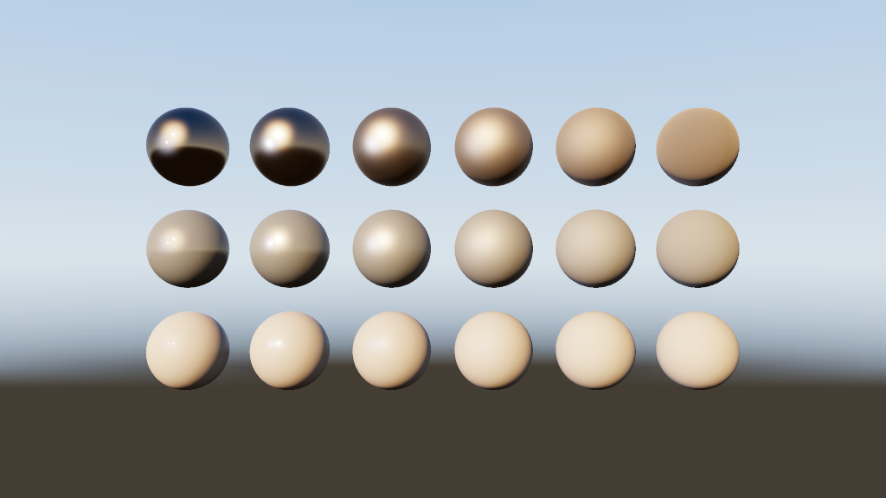

[`PbrShader`](src/SoftEngine.Core/Rasterization/Shaders/PbrShader.cs) over
[`Ggx`](src/SoftEngine.Core/Shading/Ggx.cs): Trowbridge-Reitz **D**, height-correlated Smith **V**,
Schlick **F**, with roughness squared into α (the Disney mapping). The environment arrives through
the split-sum approximation — [`PrefilteredEnvironment`](src/SoftEngine.Core/Shading/PrefilteredEnvironment.cs)
convolves the cube map once per roughness, and [`BrdfLut`](src/SoftEngine.Core/Shading/BrdfLut.cs) is
a 32×32 table of the BRDF against a white environment.

**One deliberate deviation:** the whole BRDF is scaled by π, so switching painters does not change a
scene's exposure by a factor of three. It changes the exposure, never the diffuse-to-specular ratio.

Maps degrade one at a time — metallic from a map's blue channel and roughness from its green (the
channels glTF packs them into), falling back to scalars, falling back to a mid-grey dielectric — so
the mode works over any scene, not only ones authored for it.

## Materials

Every mesh carries a [`Material`](src/SoftEngine.Core/Geometry/Material.cs): diffuse colour, albedo
map, tangent-space normal map, specular mask, metallic/roughness/emissive maps and an alpha cutoff.

**Normal mapping** needs a per-vertex UV frame, which
[`TangentBuilder`](src/SoftEngine.Core/Geometry/TangentBuilder.cs) derives by solving each triangle's
edges against its UV deltas — including the ±1 handedness mirrored UV islands flip. Frames are built
in the painter's `Prepare`, before the parallel paint phase, as mip chains are.

**Cutouts.** A leaf is not a translucent rectangle; it is painted on one, and everything outside its
outline is *not there*. `Material.AlphaCutoff` reads the albedo map's alpha per texel: above it an
ordinary opaque pixel, below it nothing at all — no shade, no depth write, no sorting. Zero (the
default) is no cutout.

- [`CutoutShader`](src/SoftEngine.Core/Rasterization/Shaders/CutoutShader.cs) *wraps* the shader that would
  have coloured the surface, and `IPixelShader.HasAlphaTest` is a `static virtual` — so the fill is
  instantiated over a type that either cuts pixels out or does not, and the test folds away
  entirely in the one that does not. The golden images are unchanged to the bit.
- The test is per pixel on the vectorized span path too. Rejecting a whole vector against the mask
  would cut every silhouette into a block-wide staircase; a test renders both ways and compares.
- **A hole in the leaf is a hole in the shadow.** The depth-only pass reads the same mask, with the
  UV interpolated by the same barycentrics — exact, not approximate, since the light's projection is
  orthographic.

glTF's `alphaMode: "MASK"` maps onto it directly, `alphaCutoff` and all. The GPU backend discards on
the same threshold. The path tracer does not — see the roadmap.

### Texture filtering

[`MipSelector`](src/SoftEngine.Core/Rasterization/MipSelector.cs) chooses one level of the chain per
*triangle*, from the ratio of its texel footprint to its screen area — cruder than per-pixel
derivatives, and it keeps the per-pixel path branch-free. What it costs is a seam: two neighbouring
triangles at slightly different depths land either side of a rounding boundary, are drawn a whole
level apart, and their shared edge becomes a visible change in sharpness that slides across a floor
as the camera moves.

`TextureFiltering.Trilinear` keeps the fraction the rounding threw away and blends the two levels the
surface falls between, so those two triangles are drawn 0.02 of a level apart rather than a whole
one. Three details:

- **A level plus a zero blend is what every other mode already asked for.** Bilinear still *rounds*
  to the nearest level and trilinear *floors* and blends up — the same choice, expressed once for a
  path that keeps the fraction and once for one that has to throw it away. The blended path is
  reached by a null test on the second level, not by a blend of zero, so nothing else is off by a
  bit. Every golden image was unchanged when this landed.
- **The two levels are mixed before the result is rounded**, or the band the blend exists to remove
  comes back as a fainter one, quantized twice.
- **The mask crosses levels with the colour it masks**, so a cutout edge is not cut from one level
  and shaded from two.

It costs a second bilinear tap wherever a surface lies between levels, so it is opt-in: `--filter
trilinear`, or the viewer's **Trilinear** checkbox. The GPU backend says the same thing in a sampler
parameter — `LINEAR_MIPMAP_NEAREST` for bilinear, `LINEAR_MIPMAP_LINEAR` for trilinear — rather than
blending levels the software path would not.

## Shadows

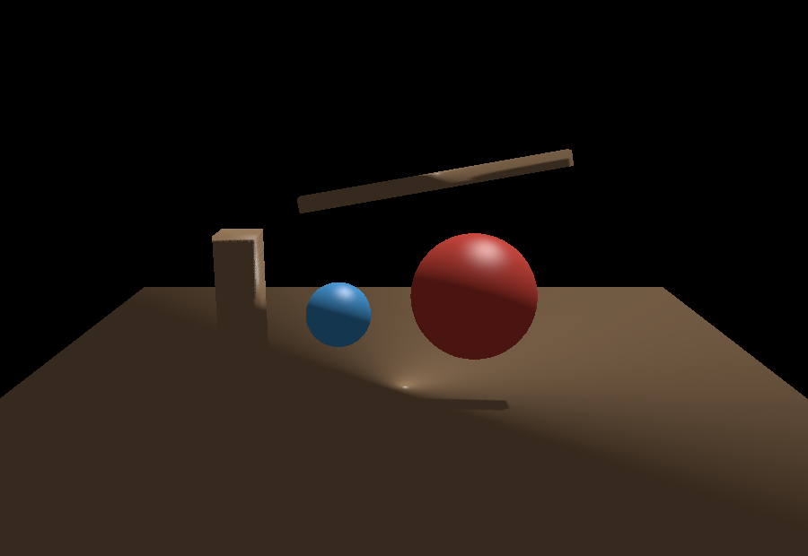

A depth-only render of the world from the light
([`ShadowMapRenderer`](src/SoftEngine.Core/Pipeline/Shadows/ShadowMapRenderer.cs)); shading a point
projects it with the same matrix and compares. The light gets an **orthographic** projection sized
to a sphere around what it covers. Bias is measured in **shadow-map texels of depth**, not raw
normalized depth, so one texel of error means the same thing on a 2-unit skull and a 1500-unit
elephant. Transparent and hidden meshes are excluded.

**Cascades** (`ShadowSettings.CascadeCount`, up to 4) fit separate maps to slices of the camera's
own view distance. Four decisions separate cascades that help from cascades that flicker: slices
divided by a blend of uniform and logarithmic schemes (`SplitBlend`); each cascade fitted to a
**sphere**, not a box, so turning the camera does not resize it; the fit **snapped to whole texels**,
so the light-space grid does not slide and re-dice every edge each frame; and each cascade
rasterizing only the casters that can reach it — which is why three cascades cost well under three
times one map. Which cascade shades a point is decided by **containment**, so
`ShadowMap.Visibility` stays a function of world position alone.

Cascades are slices of a view frustum, so the standalone API produces a single map when called
without a camera, and a parallel projection stays on the single-map path. Where the cascades go is
[`ShadowCascadePlanner`](src/SoftEngine.Core/Pipeline/Shadows/ShadowCascadePlanner.cs), shared with
the GPU backend so the two cannot drift.

## Environment and ambient

`Scene.Environment` is a [`CubeMap`](src/SoftEngine.Core/Textures/CubeMap.cs) doing two jobs.
[`SkyRenderer`](src/SoftEngine.Core/Pipeline/SkyRenderer.cs) draws it behind the scene with no cube
to rasterize — the direction comes straight from the pixel through the inverse projection, so there
are no seams and nothing to near-plane clip. It runs *between* the opaque and transparent passes,
filling only pixels still at the cleared depth.

The same map becomes the ambient term as an
[`AmbientCube`](src/SoftEngine.Core/Shading/AmbientCube.cs) — six directional averages rather than
one constant, because a ceiling and a floor in one room do not receive the same light from their
surroundings. Per-pixel painters evaluate it with the *shading* normal, so a normal map shapes the
ambient too. What a cube still cannot say is that two surfaces facing the *same* way are lit
differently because they are in different places; that is what a bake measures, below.

**Environments that keep their range.** A real sun is four orders of magnitude brighter than the
cloud beside it; clipped to white it blooms no harder than a highlight. A `CubeMap` can carry a
second copy of its faces in linear floats, and `SampleRadiance` returns those when present — read by
the skybox, `AmbientCube` and the prefilter, while the byte faces stay for thumbnails and GPU
uploads. Two sources: [`RadianceHdrCodec`](src/SoftEngine.Core/Imaging/RadianceHdrCodec.cs) reads
`.hdr` (both encodings, `EXPOSURE` divided back out) and
[`Equirectangular.ToCubeMap`](src/SoftEngine.Core/Textures/Equirectangular.cs) projects it with
supersampling; or `SkyBox.HighDynamicRangeGradient` builds one procedurally.

The viewer's **Load panorama…** and the CLI's `--env` both take one. The GPU backend uploads only
the byte faces — the one place the two backends disagree about an environment.

## Post-processing

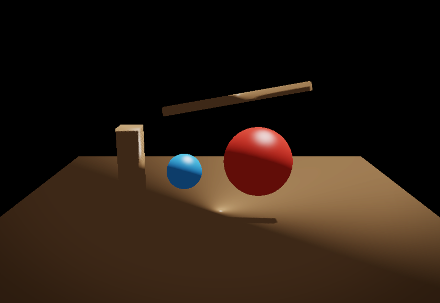

[`PostProcessStack`](src/SoftEngine.Core/Pipeline/PostProcess/PostProcessStack.cs) owns the
conversion at both ends, so effects only ever see linear float RGB.

| Effect | What it does |
| --- | --- |
| **Reflections** | Marches each reflective pixel's reflected ray through the depth buffer and blends in what it hits. See [below](#reflections). |
| **SSAO** | Reconstructs position and normal per pixel from the depth buffer, samples a hemisphere, darkens by the occluded fraction. |
| **Bloom** | Bright-pass and blur at quarter resolution, added back — a wide blur for a sixteenth of the samples. |
| **Tone map** | Exposure plus Reinhard or ACES, so values above white roll off. |
| **FXAA** | Luminance edge detection, blurred across the edge and never along it. |
| **Vignette** | Corner darkening, normalized against aspect ratio. |

Effects that need depth declare `NeedsDepth`, and the stack then reads the z-buffer back as
*view-space distance* — a screen-space radius is in world units, so it needs the distance rather
than something merely monotonic in it. Two honest SSAO limits: it only knows what is on screen, and
it multiplies the finished image, so it darkens direct light along with ambient.

## Reflections

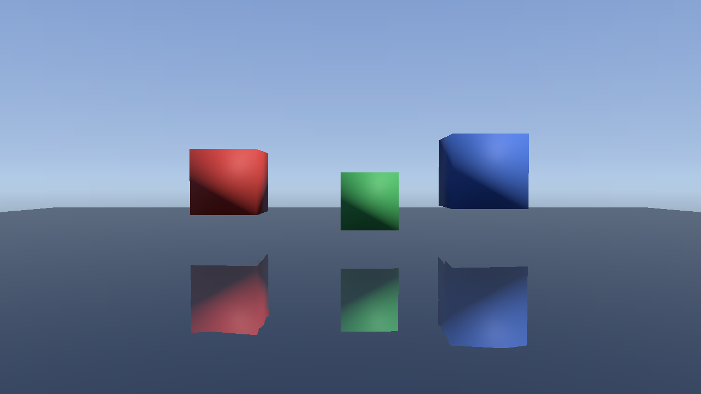

The physically-based path has always reflected the *environment* — a prefiltered cube map sampled
per roughness — so a metal here was never black. What a cube map cannot know is that there is a red
block two metres away. [`SsrEffect`](src/SoftEngine.Core/Pipeline/PostProcess/SsrEffect.cs) answers
only that: the local scene, and only where the local scene is on screen.

**It needs one thing the image does not contain.** A pixel's colour says what a surface ended up
looking like, not whether it was a mirror or a brick. Every other screen-space effect here reads
depth alone, and depth is enough for them, because occlusion and blur are properties of *where* a
surface is. A reflection is a property of what it is made of, so the rasterizer records one:

```
SurfaceReflectance  →  F0 (three bytes) + roughness (one byte), packed in a uint
```

F0 is carried **per channel** because for a metal it is both quantities a reflection needs. A
dielectric's F0 is a colourless four percent; a metal's is its albedo, which is why gold reflects a
white wall as gold. One channel would have made every metal a mirror the colour of whatever it was
looking at. The alternative — carrying albedo separately — is the deferred path the roadmap wants,
and this is deliberately not that: it is a G-buffer with two fields, written per drawn pixel exactly
the way [the mip-level view's channel](#buffer-views) is, and allocated only when something asks.

It rides on `RasterState`, so it is **per triangle**. That is its limit: a metallic or specular
*map* varies across a surface and this does not, so a gloss that was painted on reflects at its
material's average rather than per texel.

**It replaces rather than adds.** The pixel already holds that surface's environment reflection at
full Fresnel weight, so adding a scene reflection would light it twice. The composite blends toward
what the ray found by the same weight the shader used — Schlick per channel, `F0 + (1 - F0)(1 -
cos θ)⁵` — which is as close as a forward renderer gets to *"the local scene was nearer than the
sky, so use it instead"*. Where the march finds nothing the weight is zero, and the frame is exactly
the one this engine drew before there was a reflection pass. That is the whole failure story: the
degenerate case of this feature is the previous release.

Three decisions worth the words:

**The march is uniform in view space, not screen space.** A screen-space march is the more accurate
of the two — it samples every pixel the ray crosses exactly once. This one oversamples what is near
and can step over what is far. It is done this way because `Thickness`, the test that decides what a
hit *is*, is a world-space distance, and against a screen-space march its meaning would drift along
the ray. A wrong hit is worse than a missed one here: a missed reflection leaves the surface as the
shader drew it, and a wrong one draws the wrong thing.

**`Thickness` cannot be tight.** The depth buffer is a front surface with no thickness. A ray
passing *behind* a foreground object is reported as much nearer for every remaining step, which is
indistinguishable from a hit if the only test is "is the scene in front of the ray". The thickness
bounds it — beyond this the ray is behind something rather than touching it.

**Rough surfaces are cut, not approximated.** Past `MaxRoughness` a surface takes no screen-space
reflection at all. A rough surface reflects a wide cone, and a cone resolved from one ray per pixel
is noise; the prefiltered environment is convolved for exactly this case and gives the better of the
two answers. Below the cut, the reflection buffer is blurred by a per-pixel radius — not separable,
because the radius varies, which is why it is capped at a few pixels rather than scaled to the full
cone.

Two traps already paid for. A ray must start **along the normal**, not along itself: the first
sample of a ray leaving a surface at a grazing angle lands back on the surface it left, and the
depth buffer says "yes, something is here" — every glancing reflection would be of the reflector.
And the hit must be **bisected** within the step that crossed it, or the reflected image is
quantized to the march's step size and reads as bands.

The GPU backend records nothing here — its fragment shaders write one target — so it calls
`SetReflectanceRecording(false)` and the pass finds no reflectance and leaves the frame alone,
exactly as it does for the mip-level channel. A GPU frame keeps its environment reflections and
gains no screen-space ones. The path tracer needs none of this: it reflects the scene by tracing it.

## Transparency

Transparent meshes skip the opaque fill and blend over the finished image afterwards, depth-tested
against it but never writing depth. What has to be decided is the order they blend in, and there are
two answers.

**By triangle.** The default. The frame sorts its transparent triangles farthest-first by the mean
clip-space *w* of their vertices and blends each as it is drawn; tiles still parallelize, because
every tile walks the same sorted order, so the sequence at any one pixel is preserved. It costs a
sort of a list that is usually short, and it is correct exactly when a triangle has one depth to be
sorted by.

**By pixel.** `Settings.OrderIndependentTransparency`, `--oit` on the command line. Two panes that
pass through each other have no correct order: whichever is drawn second is in front along the whole
of the seam where they cross, and no arrangement of two triangles fixes it. Neither does a small
triangle sorted against a large one it lies partly behind and partly in front of — a pane meeting the
floor it stands on.

The order that is never ambiguous is the one at a pixel, so
[`FragmentBuffer`](src/SoftEngine.Core/Buffers/FragmentBuffer.cs) decides it there. A transparent
fragment is depth-tested as before and then *stored* — colour, alpha, depth — instead of blended.
Once the pass is over, each pixel holds the list of surfaces covering it and a resolve blends that
list back to front. Nothing depends on the order the triangles arrived in, which is why the renderer
stops sorting them at all when this is on.

|  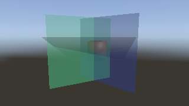 |
| :--: |
| Three panes turned through each other — the golden baseline for the per-pixel path |

Storage is divided the way the fill already is: **one arena per screen tile**, owned by the one
worker that owns that tile. A pixel belongs to exactly one tile, so no two threads reach the same
arena — nothing to lock, nothing to bump atomically, no false sharing. The resolve parallelizes over
the same rectangles for the same reason.

Only covered pixels get storage. An arena hands out a block of slots the first time a pixel is
written and remembers which pixels it has touched, so both the resolve and the per-frame reset walk
the covered pixels rather than the screen — a window's worth of glass costs a window, not a frame.
Peak memory is about `covered pixels × Capacity × 20 bytes`.

**Where it is approximate, and how you find out.** A pixel keeps `FragmentBuffer.Capacity` fragments
(eight by default). Past that, the two farthest are composited into one: `near over (far over dst)`
collapses to a single "over" whose alpha is `1 - (1-af)(1-an)`, so a surface behind both still
receives exactly the light it would have. What is lost is the ability to put a third surface between
them — which is the fragment there was no room for. The error is put at the far end deliberately,
where the nearer fragments have already absorbed most of the light. `--stats` and
`RenderStats.TransparentOverflowCount` report how often it happened, because "the picture is wrong
and nothing said so" should not be one of the outcomes.

It is off by default. It changes the picture wherever the sort was getting it wrong — which is the
point, and is also why turning it on is a decision rather than a default. A probed pixel's history
shows each stored fragment as its own entry, in the order the resolve blended them, naming the
triangle that shaded it rather than the resolve that applied it.

## Occlusion culling

Frustum culling answers *is it on screen*. In a real scene most of what is on screen is behind
something else that is also on screen, and all of it gets transformed, clipped and binned before the
depth test says so. [`OcclusionCuller`](src/SoftEngine.Core/Pipeline/Culling/OcclusionCuller.cs)
rasterizes the largest opaque meshes depth-only into a half-resolution
[`OcclusionBuffer`](src/SoftEngine.Core/Pipeline/Culling/OcclusionBuffer.cs), folds a pyramid, and
tests every other mesh's bounds against it.

**The rule is that it may only ever be wrong in the direction of drawing too much** — a mesh it
rejects wrongly is a hole in the picture. So a texel takes the occluder's *farthest* point, folding
takes the *farthest* of four, unwritten texels sit at the far plane, and a sphere is tested through
the projected corners of its box.

Three decisions that matter:

- **Coverage is measured a level above the one rasterized.** Requiring one triangle to fill a texel
  leaves a diagonal seam along every shared edge — which every quad has — so a wall acquires a crack
  and stops occluding. Level 0 is centre-sampled instead, and a level-1 texel carries a depth only
  where all four children were sampled inside geometry.
- **A big mesh is not automatically a good occluder.** `MinimumTestableMeshes` declines the whole
  pass on a world too small to repay it; without it, a handful of nested spheres are each enormous
  on screen, all get chosen, and there is nothing behind them.
- **A wall's bounding sphere reaches the camera, and that must not disqualify it.** A wall's sphere
  is as wide as its diagonal. Rejecting those throws away the best occluder in most scenes.

Measured ≈**1.5×** on 512 meshes behind a wall, and within noise elsewhere. Two limits: an occluder
is never tested against the buffer it helped write, and because level 0 is centre-sampled, a mesh
visible only through a roughly pixel-wide gap can be culled.

### Nearest meshes first

Hierarchical-Z rejects a triangle against the farthest depth already drawn into its tile, so that
bound is only ever as near as the nearest thing already there. A pass that happens to work backwards
fills most of a tile with pixels it is about to cover and tightens the bound at the end, when there
is nothing left to reject. `NearestMeshesFirst` sorts the mesh list by view depth before phase 1, so
the surfaces that will still be visible when the tile is finished are the ones drawn first.

**At the mesh and not at the triangle, which is the whole finding.** Sorting each tile's *binned
triangles* orders the fill perfectly and loses twice over: once for the sort — a hundred thousand
triangle-in-tile pairs against a few thousand meshes — and again because the fill then reads its
vertices in depth order out of arrays far larger than the cache. Measured on `dense-model` that cost
**0.60×**, of which 0.80× was the sort and the rest the lost locality. A mesh keeps its triangles
contiguous and in their original order, so the reads stay sequential.

It works: on the 4,096-cube scene it takes the pixels actually shaded from 1.11M to **0.50M** and
raises the coarse-depth rejections eightfold. It is worth about **1.05×** there and nothing
elsewhere, because that scene turned out not to be shading-bound — which is the next section. Off
while a frame is probed or captured, where the order things happened in is the thing being reported.

## Motion, TAA and motion blur

[`VelocityBuffer`](src/SoftEngine.Core/Buffers/VelocityBuffer.cs) records how far each pixel's
surface moved across the screen, pointing *backwards* so subtracting it gives the pixel to read
history from. [`VelocityPass`](src/SoftEngine.Core/Pipeline/Temporal/VelocityPass.cs) fills it by
projecting every vertex twice, with [`MotionState`](src/SoftEngine.Core/Pipeline/Temporal/MotionState.cs)
keeping last frame's matrices keyed by mesh *reference* rather than index. It is a second pass
rather than a varying so that nine painters do not carry a parameter two of them use.

**TAA.** Blending consecutive frames only steadies an image — every frame samples the same point in
every pixel. The antialiasing comes from
[`TemporalJitter`](src/SoftEngine.Core/Pipeline/Temporal/TemporalJitter.cs): a Halton sub-pixel
offset folded into the projection's third row, so it shifts clip x/y by a constant fraction of w —
a fixed number of *pixels* at every depth.
[`TemporalResolver`](src/SoftEngine.Core/Pipeline/Temporal/TemporalResolver.cs) then blends 10% of
the new frame into a reprojected history, clamped first into the 3×3 neighbourhood's colour range —
which is what handles disocclusion. A test renders a still scene with TAA, without, and at 4×
supersampling, and asserts the temporal frame is *closer to the supersampled one*.

**Motion blur** averages along each pixel's velocity, scaled by a shutter fraction (0.5 by default).
It is screen-space, so a fast object gathers background into itself where it has come from.

Both are off by default and viewer-side — a one-shot headless render has no previous frame — and the
GPU backend ignores them.

## Scene graph, animation and skinning

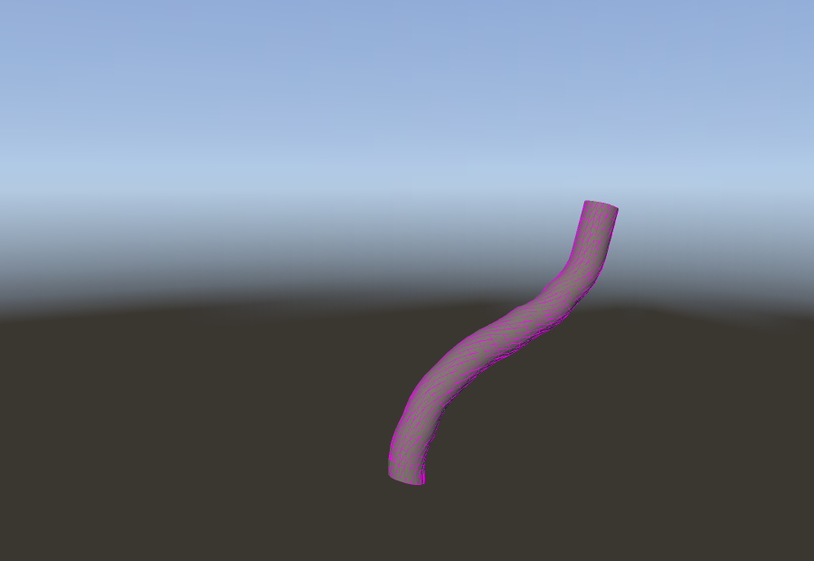

[`SceneNode`](src/SoftEngine.Core/Scenes/Graph/SceneNode.cs) is one transform in a hierarchy;
`IMesh.Parent` hangs a mesh off one. World matrices are **cached**, not walked per read — a deep
skeleton would otherwise be quadratic in its own depth — and a node's rotation is a **quaternion**,
because animation interpolates between rotations and Euler angles interpolate through gimbal lock.

An [`AnimationClip`](src/SoftEngine.Core/Animation/AnimationClip.cs) is per-node translation, scale
and rotation curves; clips hold no playhead, so two things can play one clip at different times.
[`AnimationPlayer`](src/SoftEngine.Core/Animation/AnimationPlayer.cs) owns the time, speed and
looping. Channels address nodes **by name**, resolved once at construction. Outside a clip's span
values are *held*, not extrapolated. Baked `float4x4` curves are decomposed once at load — blending
matrices component by component shears a rotating joint.

**Blending.** A player writes as it samples, so two of them over one skeleton is the second
overwriting the first, and no weight mixes them.
[`AnimationMixer`](src/SoftEngine.Core/Animation/AnimationMixer.cs) separates the halves: every
layer is sampled, nothing is written until all have been asked, and each layer blends over the
result of the ones below it by its own `Weight`. That one rule covers both cases — a crossfade is
the top layer's weight run 0 → 1; a layered head-turn over a walk is a clip that keys only the nodes
it means to take over. Two details it depends on: a channel with no curve for a component
contributes *nothing* to it rather than an identity, and the base of each frame's blend is a **rest
pose captured once**, not the nodes as they stand — reading the posed nodes back would feed the
output into its own input and creep a half-weighted layer toward full.

**Skinning.** [`SkinnedMesh`](src/SoftEngine.Core/Geometry/Skinning/SkinnedMesh.cs) blends the joint
matrices first and transforms each vertex once, writing deformed positions back into the arrays
`Mesh` already exposes — so **the renderer needs no knowledge of skinning at all**. The bind pose is
kept privately, since deforming the deformed output compounds. Four influences per vertex, flat;
normals and tangents are deformed too; the bounding sphere is remeasured with every pose. A skin
covering fewer vertices than its mesh leaves the rest at bind pose rather than throwing.

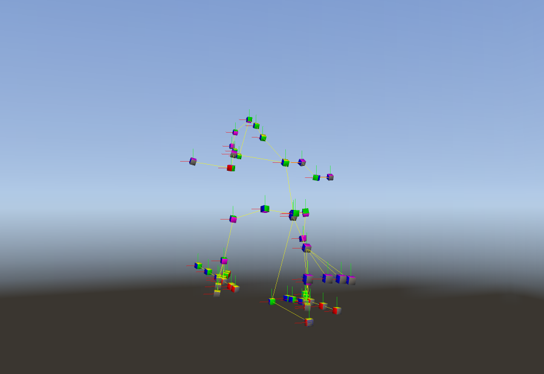

`Settings.ShowSkeleton` draws the hierarchy, since a rig is invisible by construction and a subtly
wrong rig is indistinguishable from a subtly wrong mesh. Three demos cover it: **Bone chain**
(generated geometry, rig and clip), **Juliet** (a real 205-joint skin), **Parrot rig** (a 12-second
clip over 60 nodes with no skin, so a cube per joint makes the hierarchy the model).

## Importers and primitives

[`GltfImporter`](src/SoftEngine.Core/Geometry/Import/Gltf/GltfImporter.cs) reads `.gltf` (buffers and images
beside it or as data URIs) and `.glb`.

| Read | Not read |
| --- | --- |
| Default scene's node hierarchy, with instancing | Morph targets |
| Every primitive as its own mesh, one per material | Cameras and `KHR_lights_punctual` |
| Triangles, strips and fans; indexed or not | `KHR_texture_transform` |
| Metallic-roughness materials and all their maps, `KHR_materials_emissive_strength`, `alphaMode` incl. `MASK` | A second UV set |
| Skins with inverse bind matrices; all three interpolation modes | Draco / meshopt — **refused by name** |

- **The matrix convention is the opposite of Collada's and needs no work.** glTF stores column-major
  for column vectors; this engine composes row-vector matrices, which are the transpose — and
  transposing a column-major array *is* reading it row-major. Collada's do need a transpose.
- **Sparse accessors are decoded.** Ignoring one renders the base, which for positions is the wrong
  *shape*, silently.
- **All three interpolation modes are honoured.** `STEP` is how a blink is authored;
  `CUBICSPLINE` stores three values per key, so reading it as a plain array misreads the values
  *and* triples the apparent key count.
- **Compressed geometry is refused with the extension's name**, because reading Draco accessors as
  vertices produces a mesh of noise that looks like a renderer bug.

A mesh instanced by several nodes becomes several engine meshes **sharing one vertex array**;
triangle colours are not shared. Decoding images stays out of the Core — the importer resolves an
image to bytes and the front-end supplies a decoder.

[`ColladaImporter`](src/SoftEngine.Core/Geometry/Import/ColladaImporter.cs) returns the same
`ImportedScene` type from its `ImportScene`. Collada matrices are column-vector and transposed on the
way in; the bind shape matrix is folded into the bind pose at load. `HackyImportCollada` still
returns bare meshes, which is all a static model needs.

### Primitives

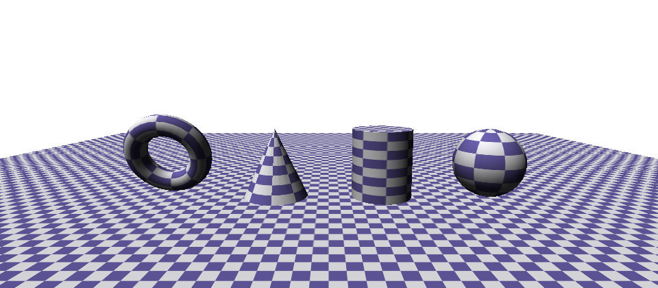

Geometry that comes from code rather than from a file, in
[`Geometry/Primitives/`](src/SoftEngine.Core/Geometry/Primitives/): `PlaneMesh`, `Box`, `Cube` and
`TexturedCube`, `IcoSphere` and `UvSphere`, `Cylinder`, `Cone`, `Torus`. All are centred on the
origin with Y as their axis, all are parameterised — segment counts, radii, whether a cylinder has
end caps, how many times a floor's texture tiles — and all but `IcoSphere` carry UVs.

- **Two spheres, because a UV sphere is the textured one.** An icosahedron subdivides into even
  triangles but has no seam to cut a UV map along, and `IcoSphere` carries no `TexCoords` at all.
  Rings of latitude have a seam, uneven triangles and slivers at the poles. Untextured, prefer the
  icosphere.
- **Three boxes, for three different jobs.** `Cube` is the fixed unit demo object whose rainbow faces
  come from a *static* colour array every instance shares — filling one cube's colours recolours all
  of them. `TexturedCube` always carries a texture. `Box` is the one a caller can size, owning its
  own colours, and is what "add a cube" produces.
- **One winding convention, written down once.** The renderer reads `Cross(v1 - v0, v2 - v0)` as the
  outward normal, so a patch wound the other way is invisible under back-face culling and lit from
  behind without it. Every primitive goes through `PrimitiveBuilder.AddQuad`, and the tests check
  the result by the divergence theorem: a surface wound outward encloses a *positive* volume, and
  one close to the analytic volume of the shape it claims to be.
- **Seams and hard edges cost duplicate vertices.** A vertex carries one texture coordinate, so the
  column where u wraps to 0 is doubled; an end cap meets its cylinder wall at a hard edge, so its
  rim is its own vertices. One shared vertex cannot hold two normals, and averaging them rounds the
  rim of every cylinder in the scene.
- **`PlaneMesh`, not `Plane`.** `System.Numerics` has a `Plane`, and a file importing both
  namespaces could then name neither.

[`PrimitiveFactory`](src/SoftEngine.Core/Geometry/Primitives/PrimitiveFactory.cs) builds any
`PrimitiveShape` to a common size, because no two of these mean the same thing by the number 1: a
cone of radius 1 is twice as wide as a torus of major radius 1, and a plane of width 1 is half of
either. Everything it builds fits the same cube, so a menu offering all of them produces objects of
the same visual weight.

## Editing: picking, gizmos and undo

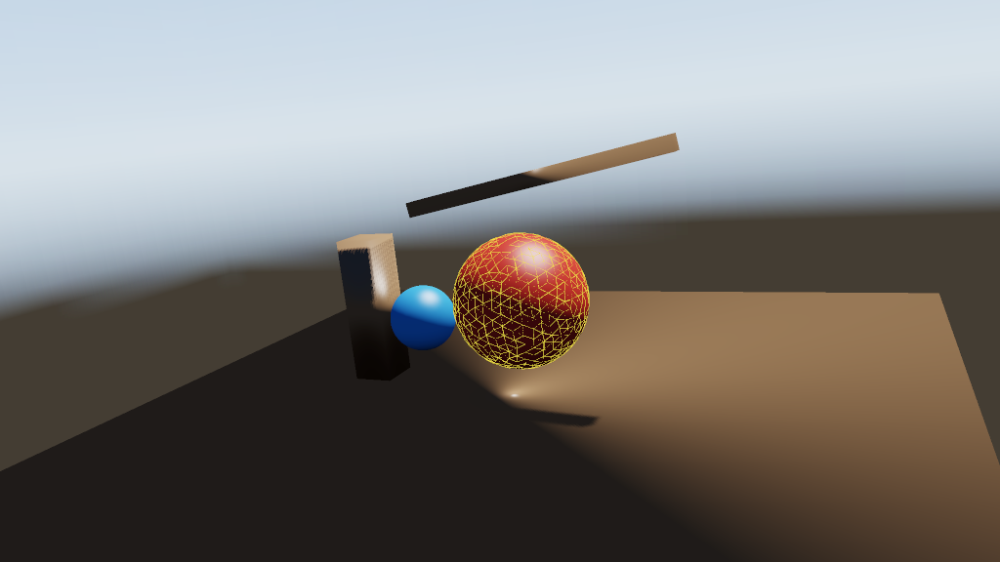

[`ScenePicker`](src/SoftEngine.Core/Picking/ScenePicker.cs) intersects the world with a ray rather
than reading an ID buffer. A ray answers what is *there* rather than what was *drawn*: it costs
nothing per frame, works on geometry the frame never rasterized, reports the exact triangle, and can
be tested with no rendering at all. The ray goes through the pixel's **centre**, matching
`FrameBuffer.ToScreen3` exactly — aiming at the corner would put the two answers half a pixel apart
along every silhouette. Möller-Trumbore, both faces, with bounding-sphere rejection first.

### Two ways to move a mesh

[`TransformGizmo`](src/SoftEngine.Core/Gizmos/TransformGizmo.cs) puts arrows, rings and boxes on the
picked mesh, built from the same ray. Four things make it usable: handles **sized in screen terms**
(a world-space gizmo is a speck on a 1500-unit elephant and swallows a 2-unit skull); the **grab
frame frozen at `Begin`**, since measuring against the moved gizmo feeds the mesh's motion back and
runs it away from the cursor; every step measured **from where the drag began**; and handles drawn
**without a depth test**, because a manipulator must be visible where it is grabbable.

[`ModalTransform`](src/SoftEngine.Core/Gizmos/ModalTransform.cs) is Blender's keyboard gesture: **G**
moves, **S** scales, the bare cursor drives it, a click or Enter confirms and Escape puts it back.
**X**, **Y** or **Z** presses it flat against a world axis, and the same key again releases it. The
two tools share their ray arithmetic through
[`GizmoMath`](src/SoftEngine.Core/Gizmos/GizmoMath.cs) — different gestures, the same geometry, and a
second copy of it would be a second set of edge cases to get wrong.

The difference is what is being aimed at. The gizmo needs a handle drawn on screen and a ray that
hits it, which costs a round trip to find something small with a button held the whole way. The
modal one needs neither, because the mesh is already chosen. That is why a modelling program has
both.

Two decisions inside it:

- **Everything is measured from where the gesture began**, which is what makes constraining half way
  through work: the constraint re-reads the same original grab through a different projection, so
  the mesh lands where naming the axis at the start would have put it rather than jumping.
- **A scale is the cursor's *travel* against a handle length, not Blender's ratio of two distances
  from the centre.** The ratio has a singularity exactly where the gesture is most likely to start —
  press S with the pointer on the mesh you are looking at and the initial distance is a pixel or two,
  so the next pixel of movement scales it by tens. A difference has no such point to avoid, and it is
  the same law the drag handles already use.

**Snapping** ([`GizmoSnap`](src/SoftEngine.Core/Gizmos/GizmoSnap.cs)) quantizes the *resulting
transform*, not the travel — rounding the travel preserves whatever offset the mesh started at, so
two meshes "snapped" to one gridline end up a fraction apart. Translation snaps in world space,
before the offset is carried into a parented mesh's own space. Both tools share one `GizmoSnap`,
because a grid is a statement about the scene being built and not about which tool is building it.

### Adding, deleting and undo

**Shift+A** adds a primitive at the point the view is centred on — the closest thing this viewer has
to Blender's 3D cursor — sized to the world it is joining rather than to a fixed number of units,
since the demos span three orders of magnitude. **X** or **Delete** removes the selected mesh.

[`EditHistory`](src/SoftEngine.Core/Editing/EditHistory.cs) stores whole transforms rather than
deltas: undo has to be exact, and accumulated float deltas do not return to where they started. A
drag that moved nothing records nothing; the tools *produce* a command but do not push it, since
neither has an opinion about whether the application keeps a history; loading a world clears the
stack, because the commands point at meshes no longer in the scene.

[`MeshListEdit`](src/SoftEngine.Core/Editing/MeshListEdit.cs) makes a deletion reversible by keeping
the mesh alive inside the command — nothing is rebuilt or re-imported to undo one, it was only
unlisted. It restores the mesh's **position in the list** too: a scene document addresses meshes by
index and so does the debugger's `obj:7`, so putting one back at the end would silently renumber
everything after it.

One limitation, and it is the format's: rotation drives the mesh's own **Euler angles**, so with two
of three at zero a ring turns about the world axis drawn, and with all three set it does not.

## Scene files

`File ▸ Save scene as…` writes JSON
([`SceneSerializer`](src/SoftEngine.Core/Scenes/Serialization/SceneSerializer.cs)): camera,
projection, lights, per-mesh transforms, shading, fog, shadows and the post stack.

```json
{
  "version": 1,
  "world": { "demo": "cascades" },
  "camera": { "position": [0, 12, -48], "orientation": [0, 0.38, 0, 0.92] },
  "lights": [
    { "kind": "directional", "direction": [-0.4, -0.6, -1], "intensity": 1.1, "color": [255, 240, 214] }
  ],
  "rendering": { "painter": "Pbr", "showXZGrid": true, "debugView": "Off" }
}
```

**It deliberately contains no vertices** — a scene document names the model and records what was done
to it. Every section is optional and a missing one means "leave this alone", which is what makes the
format writable by hand. Vectors are one-line arrays. A light with no falloff writes **no range at
all**, since recording infinity as a large number turns "no falloff" into "an enormous falloff".
Meshes are addressed by index, and an index past the end is skipped rather than thrown on. The
engine never interprets `world` — resolving a demo name is a question about the machine the file is
opened on.

## Rendering on the GPU

The same scene, the same `IPainter`, the same settings and a finished frame in the same
`FrameBuffer` — what changes is where the triangles are rasterized.

**"GPU" means a graphics adapter.** An OpenGL context is happy to be served by a CPU implementation
(llvmpipe, GDI Generic, SwiftShader), which would run this engine's own job on the CPU through a
driver, and slower. So the backend reads the driver's account of itself and refuses to call that
hardware. An unrecognised device is treated as hardware — new cards appear constantly and new CPU
rasterizers essentially never.

**What runs where.** Everything that scales with triangles × pixels runs on the adapter: shadow
cascades, the opaque fill, sky, transparency, wireframe. Everything that runs once over the finished
image runs where it already did — post-process, debug views, gizmos — over a frame read back into
the engine's buffers. That read-back is the deliberate trade: reproducing those passes in GLSL would
be a second implementation of each, free to disagree with the first. It is also the ceiling on what
the backend is worth, since the transfer is linear in pixels — and supersampling multiplies the
transferred area by the *square* of the factor.

**Agreement.** The shading in [`common.glsl`](src/SoftEngine.Gpu/Shaders/common.glsl) is a
function-for-function port of the CPU shaders, and cascade placement is one shared object. A sphere
over a ground plane at 480×360 across every feature the backend touches gives a mean absolute
difference of **0.1–1.0 out of 255**, with 0.1–0.7% of pixels above 8/255 — nearly all of it
silhouette coverage, a one-pixel outline where the two rasterizers disagree about edge ownership.
Two things deviate knowingly: the PBR path uses Karis' analytic environment BRDF and the sky's mip
chain rather than a per-roughness convolution, and OpenGL's line-mode polygons make the wireframe
overlay *more* continuous than the software one, whose Bresenham depth disagrees with its own fill.

**What it does not do.** The per-pixel history reports nothing (a GPU discards rejected fragments
inside the hardware). The occlusion pre-pass is absent by design — early-depth rejection does that
job without a pass over the frame first. The mip-level view has nothing to show, since the sampler
chooses the level per pixel with nowhere to write it down. Overdraw needs a second geometry pass and
the shadow map a copy back, so both are computed only while open. There is a ceiling of **16 lights**
in the fragment shader, where the software path has none. Order-independent transparency is the
software path's: a fragment list per pixel is not something the fixed blend stage can be asked for,
so the adapter sorts transparent *meshes* by depth and blends them in that order whether or not
`--oit` was passed — a coarser sort than the software renderer's own default, which sorts triangles.

## Path-traced reference

Everything the rasterizer does about indirect light is an approximation standing in for something,
and none of them can be checked against anything.
[`PathTracer`](src/SoftEngine.Core/Tracing/PathTracer.cs) is the thing to check them against — an
`IRenderer` like the other two, taking the same scene and the same post stack, and ignoring the
painter it is handed because choosing a shading model per mesh is what it exists not to do.

The walk itself is [`PathIntegrator`](src/SoftEngine.Core/Tracing/PathIntegrator.cs), which the
irradiance bake asks the same question of from points that have no pixel — so what a bake stores as
ambient light is what this renderer would have found there, by construction rather than by care.

It computes **interreflection**, **true ambient occlusion**, and **shadows with no bias to tune**.
It is not a production renderer: no bidirectional tracing, no MIS, no light hierarchy, and delta
lights sampled explicitly — so hard shadows, no caustics, and a room lit through a keyhole stays
noise for a long time.

**The acceleration structure.** [`SceneGeometry`](src/SoftEngine.Core/Acceleration/SceneGeometry.cs)
flattens the world into one array of world-space triangles and [`Bvh`](src/SoftEngine.Core/Acceleration/Bvh.cs)
is a **surface-area-heuristic** hierarchy over it, binned twelve ways per axis. Children are
allocated in adjacent pairs so a node names only the left; traversal pushes the far child first, so a
hit found early rejects the far box. It is built once and read by every ray — the opposite of the
per-frame trade the rest of the renderer makes. `SceneGeometry.Stamp` is the cheap check that the
world has not moved under it.

`TraceSettings.DirectLightScale` defaults to π, matching the PBR painter's exposure so the two images
are comparable; `--physical` sets it to 1 for an internally consistent image about three times darker
wherever a light is doing the work. The environment lights the trace at `SkyIntensity` and
`AmbientIntensity` is ignored — it scales a fudge the tracer does not make.

**In the viewport,** *Rendered by → Path tracer* traces two paths per pixel per paint and averages
into what is there, up to 512 samples or until something moves. Seeded per pixel rather than from a
shared generator, so two runs produce the same image down to the last bit.

## Baked indirect light

The rasterizer and the path tracer are usually presented as alternatives: one fast and approximate,
the other slow and correct. A bake is the third thing — the slow renderer run *ahead of time* over
the part of the image that does not change quickly, and the fast one reading the answer.

Bounce light is exactly that part. It takes a hundred rays a point to compute and it varies over
metres; a specular highlight varies over a pixel and has to be recomputed every frame from every
angle. So [`IrradianceBaker`](src/SoftEngine.Core/Baking/IrradianceBaker.cs) fires rays out of a grid
of points and asks [`PathIntegrator`](src/SoftEngine.Core/Tracing/PathIntegrator.cs) — *the path
tracer's own walk*, now shared between the two — what comes back along each one.

**Probes, not lightmaps.** A lightmap needs a second, non-overlapping UV set per mesh; nothing here
unwraps one and glTF's second UV set is not read. A probe grid needs no UVs at all — and it lands on
a type the engine already had. An [`AmbientCube`](src/SoftEngine.Core/Shading/AmbientCube.cs) *is* a
probe, so an [`IrradianceVolume`](src/SoftEngine.Core/Shading/IrradianceVolume.cs) is one per place,
trilinearly blended, and a shader still asks the same question it always did — which is why the
volume drops into a scene without any painter knowing it exists.

- **The lights are never in it.** A probe collects the light arriving from the *surfaces* around it,
  which is their direct lighting after it has bounced. A delta light has no size for a ray to land
  on, so it cannot be collected — and that is what keeps the rasterizer from counting the sun twice
  when it adds its own direct term to the ambient one.
- **A face is the cosine-weighted mean radiance about its axis**, not the sum — the same quantity
  `AmbientCube.FromEnvironment` reduces a sky to. That is what makes the two sources interchangeable
  rather than merely similar: a bake under a uniform sky reproduces that sky's own value, and there
  is a test that says so.
- **There is no 0.35 here.** `Scene.AmbientIntensity` exists because the sky's brightness is not what
  a surface facing it receives. A bake answers that by measuring it, so it needs no fudge — and a
  baked scene is correspondingly brighter than the guess it replaces.
- **A probe inside a wall is the trap.** It sees the inside of the wall in every direction and bakes
  black; blended into the floor beside it, that black is a dark smear along the bottom of every wall
  in the scene. Probes are tested with a cheap unshaded pass first — how many directions end on the
  *back* of a surface — and a buried one lends no weight to the blend, which is then renormalized so
  a point with one usable neighbour is lit by that neighbour rather than by a seventh of it.
- **Directions are a jittered Fibonacci sphere.** Random directions leave gaps wide enough to miss a
  window; an unjittered set makes every probe sample the *same* few hundred directions, which turns
  the estimator's error into a pattern that repeats across the grid instead of averaging out between
  neighbours.

Probes are seeded from their own index, so a bake is reproducible to the bit however many threads
ran it — the same property the frame renderer's per-pixel seeding buys.

**What it costs and what it does not do.** A few hundred probes at 128 paths each is about a tenth of
a second on the bundled models. A volume describes one *arrangement* of a world: move a wall or a
light and it describes a room that no longer exists, and nothing notices, because noticing would mean
rebaking. Loading a world in the viewer throws the bake away for that reason. Indirect light also
varies no faster than the grid does, so contact shadows stay SSAO's job. Two renderers ignore a
volume for opposite reasons: the path tracer computes the thing it approximates, and the GPU backend
holds its ambient in six uniforms, which is a cube and not a grid — so `--bake` on the automatic
backend picks the CPU rather than silently ignoring what was asked for.

## Graphics debugger

Modelled on [Rasterizr Studio](https://github.com/tgjones/rasterizr). Because the pipeline runs on
the CPU, the panels show what the renderer actually did rather than what a driver reported.

| Panel | Shows |
| --- | --- |
| **Graphics Event List** | Every step of the frame in pipeline order. |
| **Graphics Object Table** | Every object the frame touched, with sizes and counts. Meshes carry an **active** checkbox that drops them from the frame. |
| **Pixel History** | For the selected pixel: the clear, then each triangle that tried to write it — *including the ones the depth test rejected* — then, where transparency is resolved per pixel, each stored fragment as the resolve blended it, ending with the post-process pass. |

Identifiers are shared: `obj:7` in the event list is `obj:7` in the object table.

Recording is cheap by construction: events are a `readonly record struct` in a reused buffer,
formatted only for the rows actually drawn; the pixel probe is a single int compare inside
`PutPixel`, off (`-1`) unless a pixel is selected, with the "what is drawing" context thread-static
because each worker owns disjoint rows; triangle vertices are snapshotted only on a hit.

**Frame history** (`View ▸ Frame history`) files each finished frame into a
[`FrameCapture`](src/SoftEngine.Core/Diagnostics/FrameCapture.cs). Off by default and separate from
event recording — capturing events writes into a reused buffer, *keeping* a frame copies it. The pin
is a frame **number**, not a list index, since the window slides. **The image is not kept**: a
capture holds the events, the probe history and the counts, and none of the pixels.

A new `GraphicsEventKind` or `PixelWriteSource` needs a case adding in `GraphicsEvent.Describe` and
in the viewer's `PixelHistoryPanel.BuildWriteNode`, or it shows up blank.

### Buffer views

[`BufferVisualizer`](src/SoftEngine.Core/Pipeline/Debugging/BufferVisualizer.cs) presents one of the
frame's own buffers in place of the shaded image. A view the frame carries nothing for leaves the
image alone and says so in the event list.

| | |
| :--: | :--: |
| 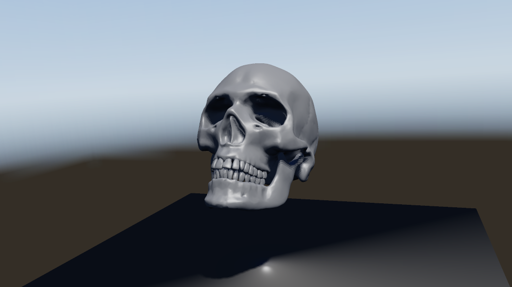 | 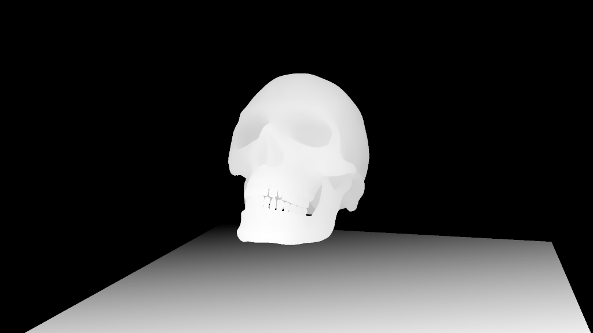 |
| **Shaded** | **Depth** — auto-ranged over the geometry on screen, since a perspective depth buffer shown literally is a white screen |
| 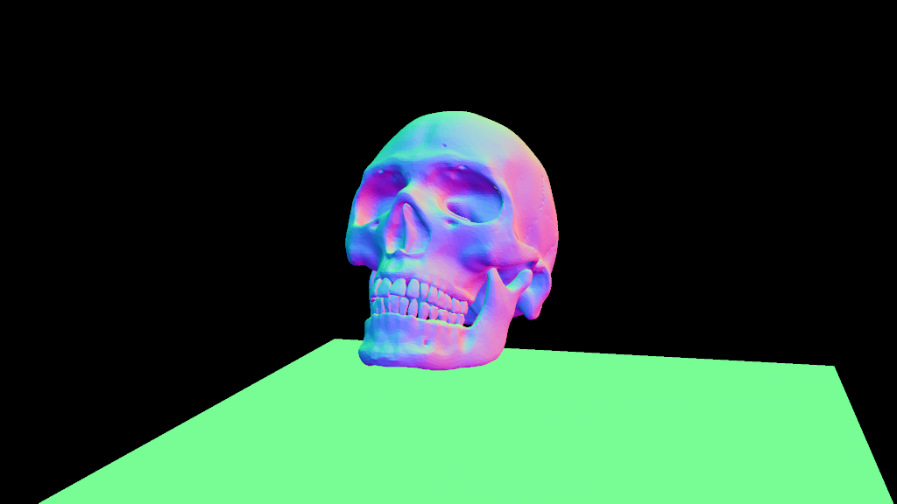 | 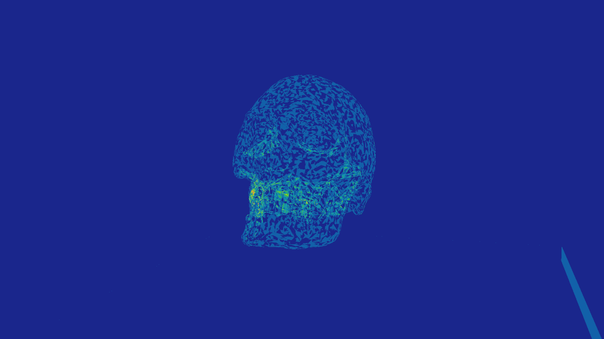 |
| **Normals** — differenced out of depth, since a forward renderer has no normal buffer | **Overdraw** — writes per pixel, blue through red |
| 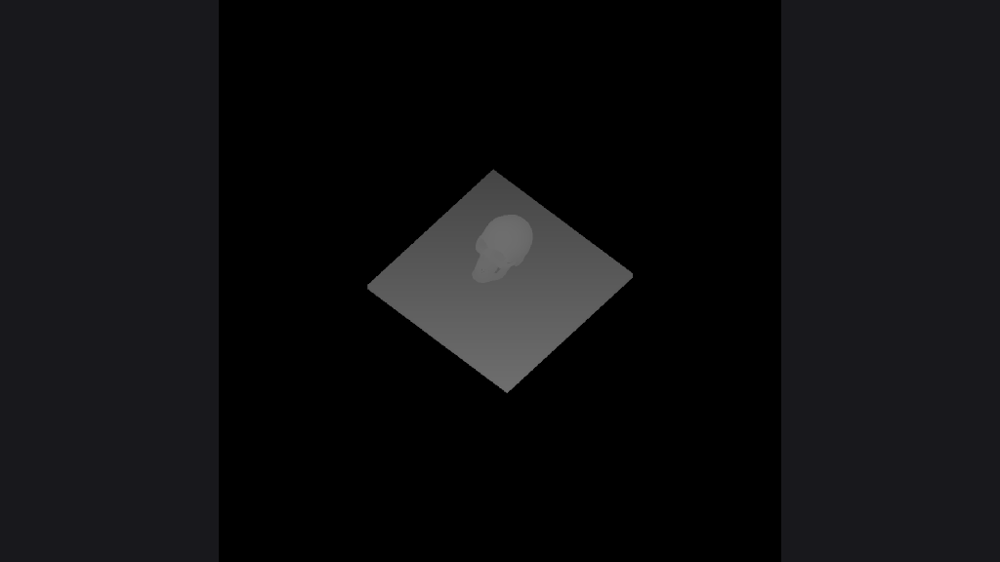 | |
| **Shadow map** — every cascade side by side, nearest first, each tinted | |

Three more have no screenshot because they are about what is *not* drawn:

- **Occlusion buffer** — the pyramid the culler tests against. The level shown is the finest one a
  query may read (level 1), not the level rasterized: level 0 is centre-sampled, so showing it would
  paint a confident picture of occlusion the culler cannot use, and that gap is exactly what you
  opened the view to find. Uncovered texels are a cold blue-grey rather than black, because "nothing
  here" and "something at the far plane" are different answers.
- **Velocity** — direction as hue, speed as brightness, grey where nothing moves. The buffer whose
  errors are otherwise invisible: a velocity pointing the wrong way reads as the technique being
  imperfect rather than as a buffer being wrong.
- **Mip level** — which level of the chain each pixel sampled, as a categorical ramp (level 0 red,
  cooler with every halving) rather than a heat map, because what you look for is where one band
  ends and the next begins. Untextured geometry is dark grey and the background black: a painter that
  sampled no map made no mip decision, and colouring it level 0 would fill most scenes with a
  confident red. Mip selection is otherwise the one decision in the frame with no visible failure
  mode — too fine shimmers, too coarse blurs, and both read as the *texture* being wrong.

Overdraw counts **writes the rasterizer attempted**, not triangles that geometrically cover the
pixel — a triangle the tile's depth bound dropped never shows up. That is the intended reading: the
view answers "what did this frame pay for".

## Testing and benchmarks

Most of the suite is ordinary unit tests, and there is a whole class of regression none of them can
reach: a renderer can satisfy every property a test names and still produce a visibly wrong picture.
Nothing in 600 passing tests notices that the specular term came out a tenth dimmer.

**Golden images.** Seventeen generated scenes are rendered headless at 320×180 and compared against
PNGs committed beside them, so a change shows up in the diff as a picture. Scenes are *generated*
rather than loaded — a baseline depending on a model in the assets folder breaks when the model is
re-exported, which teaches everyone to re-record on failure without looking. `SOFTENGINE_UPDATE_GOLDEN=1`
is the only way to rewrite one.

Comparison is three numbers, because the failures worth catching have different shapes: a shading
term that moves a percent moves nearly every pixel a little (a mean sees it, a count does not); a
culling bug moves a few pixels a lot (a count sees it, a mean averages it away). Exact equality is
tempting but FMA contraction is a property of the host. A failing run writes the actual frame and a
diff image beside the baseline.

Baselines resolve through `[CallerFilePath]` so that a re-record rewrites the working tree — which is
why `DeterministicSourcePaths` is switched **off** for the test project. Left on, CI rewrites a whole
fresh baseline set outside the repo, fails once, and then passes on any re-run, comparing renders
against images it generated itself moments earlier.

The occlusion pass gets a stronger test: every golden scene is rendered twice, with the pass on and
off, and compared at **zero** tolerance. An optimization that decides what not to draw is only
correct if what is drawn does not change — no count of rejected meshes says that.

### Reading files nobody here wrote

The parsers are the only part of this engine that ever sees bytes written somewhere else, and the
rest of the suite only ever checks that a **correct** file decodes correctly. That is the easier
half. A reader can be right about every well-formed file and still be one truncated download away
from an unhandled exception.

So `ParserFuzzTests` takes a file that works, breaks it — a flipped byte, a length field set to
`0xFFFFFFFF`, the end cut off, a digit grown into a much larger number, one to three of those
compounded — and requires the reader to still fail as `InvalidDataException` or
`NotSupportedException` (or `JsonException` / `XmlException`, since two of these formats *are* a JSON
and an XML document). What is deliberately **not** accepted is `IndexOutOfRangeException`,
`OverflowException` or `OutOfMemoryException`: those are the bug rather than the report of one, and a
suite that tolerated them would pass while the thing it exists to catch went on happening.

Mutations are seeded by their round number, so a failure at round 6,857 is a failure anyone can
reproduce. The default sweep is 2,000 rounds a reader — a couple of seconds, which is what a test
everybody runs on every change can cost. `SOFTENGINE_FUZZ_ROUNDS` runs the long version.

It found three, and none of them were in the code anyone would have looked at:

- **A Collada face indexing past its own vertices** surfaced as an `IndexOutOfRangeException` from
  inside `Mesh`'s constructor, where it computes vertex normals — the model never opened, and the
  message named neither the file nor the face. The glTF reader had dropped out-of-range faces from
  the day it was written; `BuildTriangleIndices` now takes the vertex count and does the same for
  the other two, which is the fix being in one place instead of three.
- **One non-numeric token in a Collada index array** threw `FormatException` out of
  `Convert.ChangeType` and took the whole model with it — while the animation half of the *same
  importer* had always skipped tokens it could not read. The two halves reading one file to two
  standards was the actual defect.
- **A corrupt DEFLATE stream in a PNG** threw `ZLibException`. Truncated data was already handled;
  data that was the wrong length and data that was the wrong *bytes* fail differently inside the
  decompressor, and only one of them had been thought about.

Alongside those, the three formats that carry their own dimensions — PNG, Radiance HDR, glTF
accessors — now bound them before allocating. A sixty-byte PNG header can name a hundred-gigapixel
image, a twenty-byte Radiance resolution line can do the same, and `{"count":2000000000,"type":"MAT4"}`
is forty characters asking for a hundred and twenty-eight gigabytes of floats — which in `int`
arithmetic does not even reach the allocation, it wraps negative first. None of them are checks a
well-formed file ever meets.

### Benchmarks

```bash
dotnet run -c Release --project bench/SoftEngine.Benchmarks
dotnet run -c Release --project bench/SoftEngine.Benchmarks -- --compare occlusion
```

Seven scenes covering the shapes the renderer is built around, reporting the **median** frame time —
a desktop frame-time distribution has a long right tail belonging to the scheduler, and one preempted
frame moves a mean but not a median. Warm-up frames are discarded. `--compare` re-runs each scene
with one optimization off — `hi-z`, `occlusion`, `spans` or `order` — and reports the ratio.
Hierarchical-Z is worth ≈**2.4×** on the overdraw scene and ≈1× elsewhere, occlusion culling ≈**1.5×**
on the scene built around it, nearest-meshes-first ≈**1.05×** on the scenes with depth to them.

Those first two numbers used to be larger, and the optimizations did not get worse: the frames they
are a fraction of got faster, once the contended counter below stopped dominating every one of them.
A speedup ratio is a statement about the baseline as much as about the change, which is the argument
for keeping the switch rather than writing the number down and moving on.

**Work the frame no longer does.** Measured at 1280×720 on twenty threads, best of thirty frames.

| Change | Effect |
| --- | --- |
| Parallel fill chosen by **tile coverage** rather than triangle count — sixteen viewport-filling triangles are 14M pixels and were drawn on one core | `big-triangles` 22.3 → 3.4 ms |
| The clear split into bands of rows, and not clearing a buffer the HDR resolve rewrites anyway | `overdraw` 7.8 → 6.0 ms, `shadows` 7.2 → 5.4 ms |
| Model-to-view transform split across cores (a pure map); the cull phase around it stays sequential, since the draw list's order matters | `dense-model` 9.2 → 7.9 ms |
| Vectorized spans: one packed divide instead of eight scalar ones | 1.16× `big-triangles`, 1.08× `shadows` |
| The pixel counters striped across cache lines and flushed per triangle rather than per scanline — see below | `many-meshes` 14.3 → 4.8 ms, `big-triangles` 4.6 → 2.2 ms |

### The statistics cost more than the rasterizer

`RenderStats` counts two things per pixel: how many were drawn and how many the depth test rejected.
The fill accumulated them locally and flushed them with `Interlocked.Add` once per **scanline** —
which reads as careful, and is the single most expensive thing the renderer used to do.

A tile is 32 pixels wide, so a scanline is at most 32 pixels, so a frame of ordinary geometry flushes
those counters a few hundred thousand times. Every flush from every one of twenty threads landed on
the same two adjacent `int`s, which is to say the same 64-byte cache line, which then spent the whole
fill phase bouncing between cores. The cost was never the additions — an uncontended atomic add is
about twenty cycles — it was that no core could hold the line long enough to do anything else.

Deleting the two calls outright was worth **2.6×** on the 4,096-cube scene, which is how the
measurement was made: not by guessing which arithmetic was slow, but by removing a line that could
not possibly be slow and finding the frame time halve. Keeping the counters exact and giving each
worker a stripe of its own recovers essentially all of it.

The general shape is worth stating, because nothing about the code looked wrong: **a shared counter
is a shared cache line, and a shared cache line in a parallel inner loop is a lock you did not know
you took.** Batching alone would not have fixed it — flushing per triangle instead of per scanline is
worth the last few percent, and striping is worth the rest.

## Roadmap

- Replace `Mesh`'s Euler `Rotation3D` with the quaternion `SceneNode` already uses — which is also
  what would let the gizmo's rings, and a modal **R**, turn a mesh about an arbitrary axis.
- Probes in a scene document, so a bake outlives the session that made it — which needs somewhere to
  put a few thousand cubes that is not the JSON a person is expected to edit by hand.
- A per-texel bake, which needs a UV unwrapper before it needs anything else.
- Alpha cutouts in the **path tracer**, which needs an any-hit predicate threaded through the BVH's
  traversal loop.
- More than one shadow-casting light, which needs a depth buffer and a pass per light.
- Morph targets, the one part of glTF's animation the importer reads past.
- A deferred or visibility-buffer path, so SSAO could darken the ambient term alone — and so
  [reflectance](#reflections) could be recorded per texel instead of per triangle, which is the one
  thing standing between a painted-on gloss map and a reflection that follows it.
- Reflections on transparent surfaces, which resolve after the opaque pass the reflection channel is
  written by, and so currently reflect nothing.
- Testing occluders against each other, by building the pyramid front to back.
- A JPEG decoder for the headless renderer.
