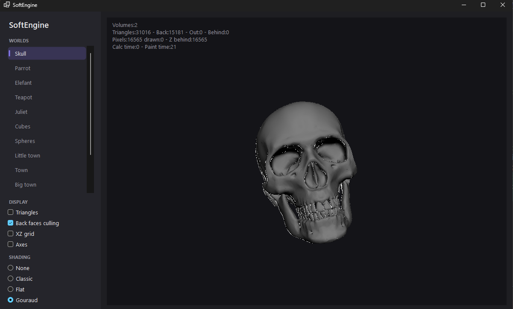
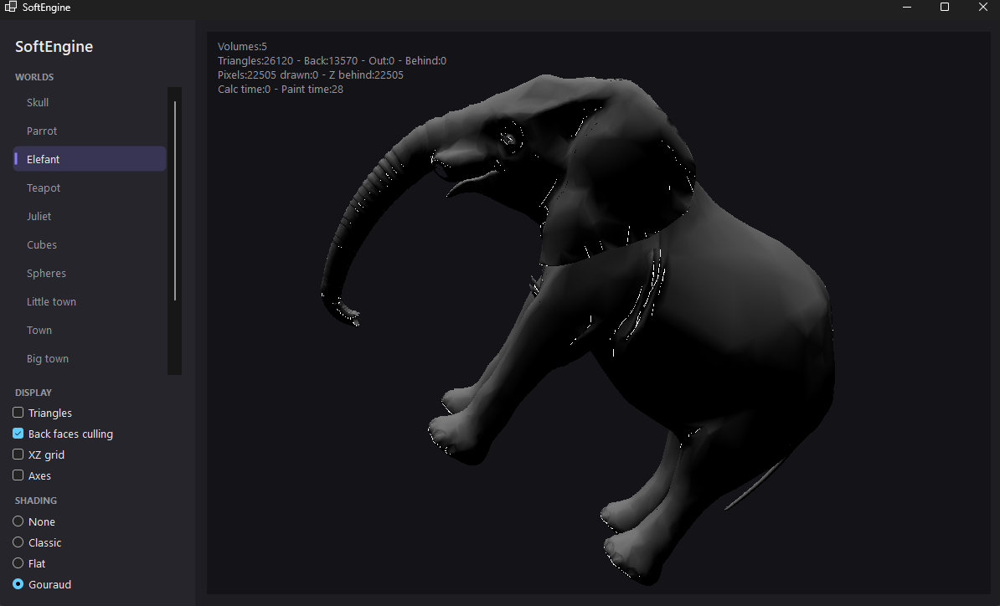
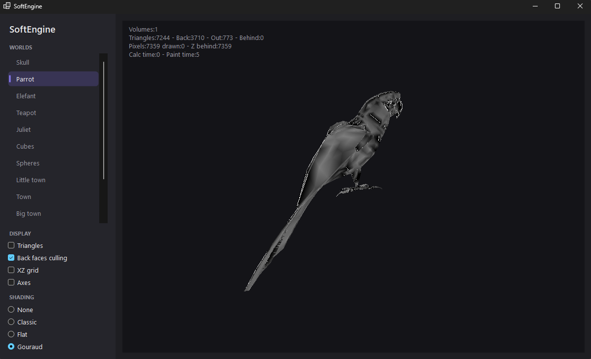

# SoftEngine

A **software 3D rasterizer** written in C#. The entire pipeline — model transforms, projection, culling, clipping, scanline rasterization, z-buffering and shading — runs on the CPU with no GPU or graphics-API dependency. A WinForms front-end renders live into a bitmap so you can orbit models, switch shading modes, and watch per-frame render statistics.



|  |  |
| :--: | :--: |
| Elephant — 26k triangles across 5 meshes | Parrot — 7k triangles |

## What it does

- Loads and renders 3D models (Collada `.dae`) and procedural primitives in real time.
- Rasterizes triangles with a generic scanline filler and a depth (z) buffer.
- Supports several shading modes — wireframe, solid, flat, and Gouraud — selectable at runtime.
- Provides an interactive arc-ball camera, gizmos (world axes, ground grid), and a live stats overlay.

## Shading modes

| Mode | Painter | Description |
| --- | --- | --- |
| **None** | — | Geometry only (combine with the wireframe overlay to see edges). |
| **Classic** | `ClassicPainter` | Flat per-triangle base color, no lighting. |
| **Flat** | `FlatPainter` | One Lambert (N·L) intensity per triangle from its centroid normal. |
| **Gouraud** | `GouraudPainter` | Per-vertex Lambert intensity interpolated across the triangle. |

A `WireFramePainter` overlay (Liang–Barsky homogeneous line clipping) can be drawn on top of any mode.

## Rendering pipeline

```
model ──worldMatrix──▶ world ──viewMatrix──▶ view ──projectionMatrix──▶ clip ──/w──▶ NDC ──▶ screen
```

Per frame, the `Renderer` ([`Pipeline/Renderer.cs`](src/SoftEngine.Core/Pipeline/Renderer.cs)):

1. Clears the color and z-buffers.
2. Transforms each mesh's vertices into view space (pooled `VertexBuffer` per mesh).
3. Rejects triangles behind the far plane, back-facing triangles (optional culling), and triangles outside the view frustum.
4. Projects survivors into clip space, maps to screen space, and hands them to the active painter.
5. Draws optional gizmos (XZ grid, world axes).

The rasterizer ([`Rasterization/ScanlineRasterizer.cs`](src/SoftEngine.Core/Rasterization/ScanlineRasterizer.cs)) sorts a triangle's vertices by Y, splits it at the middle vertex, and walks two half-triangles, interpolating depth plus an arbitrary *varying* payload. Painters only supply a **varying** type and a **shader** — both are `struct` generics, so the JIT devirtualizes and inlines the per-pixel shade call with no allocation on the hot path.

## Interactive app

The WinForms app ([`SoftEngine.WinForms`](src/SoftEngine.WinForms)) renders the scene into a 32-bpp bitmap that is blitted to a `Panel3D`.

| Control | Action |
| --- | --- |
| **Left-drag** | Orbit the arc-ball camera |
| **Demo list (double-click)** | Load a model or procedural scene (skull, parrot, elephant, teapot, cubes, spheres, towns…) |
| **Shading radios** | Switch between None / Classic / Flat / Gouraud |
| **Checkboxes** | Toggle wireframe triangles, back-face culling, XZ grid, world axes |

A stats overlay reports triangle counts (total / back-facing / out-of-view / behind), pixel counts (drawn / z-rejected), and calculation vs. paint timing per frame.

## Project layout

```
src/
├── SoftEngine.Core/        # engine, no UI dependency (net10.0 class library)
│   ├── Buffers/            # FrameBuffer (color + z-buffer), pooled Vertex/World buffers
│   ├── Geometry/           # IMesh/Mesh, Triangle, primitives, Collada importer
│   ├── Pipeline/           # Renderer, settings, homogeneous clipping
│   ├── Rasterization/      # scanline filler, painters, shaders, varyings
│   ├── Scenes/             # world, camera, projection, lights
│   └── Shading/            # Lambert lighting
└── SoftEngine.WinForms/    # interactive front-end (net10.0-windows)
```

## Requirements

- [.NET 10 SDK](https://dotnet.microsoft.com/download)
- Windows (the interactive app uses WinForms; `SoftEngine.Core` itself is platform-neutral).

## Build & run

```bash
# build everything
dotnet build SoftEngine.slnx

# run the interactive app
dotnet run --project src/SoftEngine.WinForms
```

## Performance notes

The renderer avoids managed-heap traffic on the pixel hot path:

- **`ColorRGB` is a `readonly struct`** — shaders can produce a color per pixel without allocating.
- **Struct-based varyings and shaders** let the JIT inline the shade call instead of dispatching through an interface.
- **`ArrayPool`-backed vertex buffers** are rented per frame rather than allocated.

## Roadmap

- Cache per-mesh vertex buffers across frames for static scenes (avoid per-frame `VertexBuffer` allocation).
- Perspective-correct varying interpolation.
- Replace `Rotation3D` (Euler angles) with quaternion-based rotation.
- Texture mapping.

## Credits

Inspired by David Rousset's tutorial series
[*Learning how to write a 3D soft engine from scratch in C#, TypeScript or JavaScript*](https://www.davrous.com/2013/06/13/tutorial-series-learning-how-to-write-a-3d-soft-engine-from-scratch-in-c-typescript-or-javascript/),
which this project started from before growing its own pipeline, rasterizer, and shading system.

## License

[MIT](LICENSE) © Hilthon
