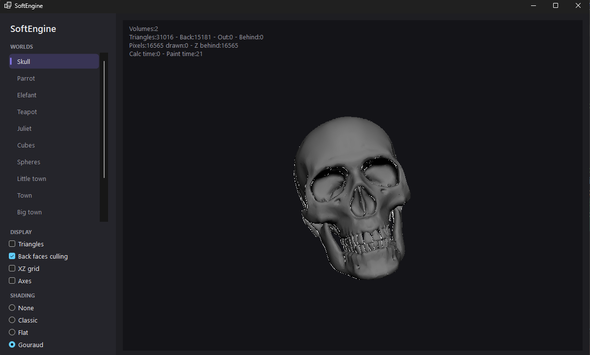
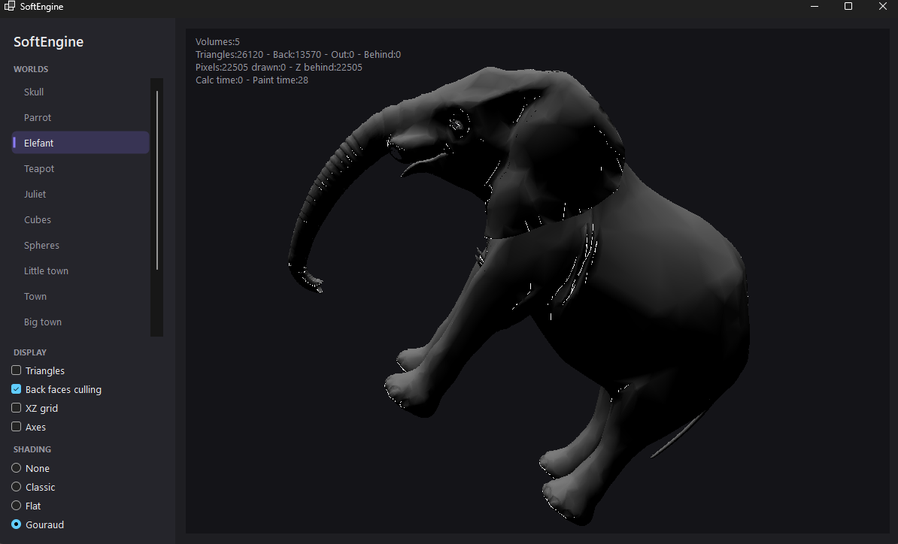
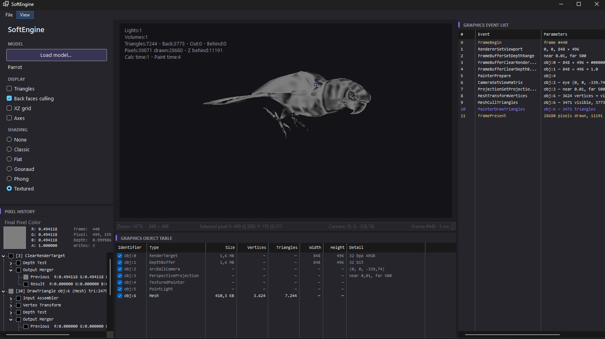
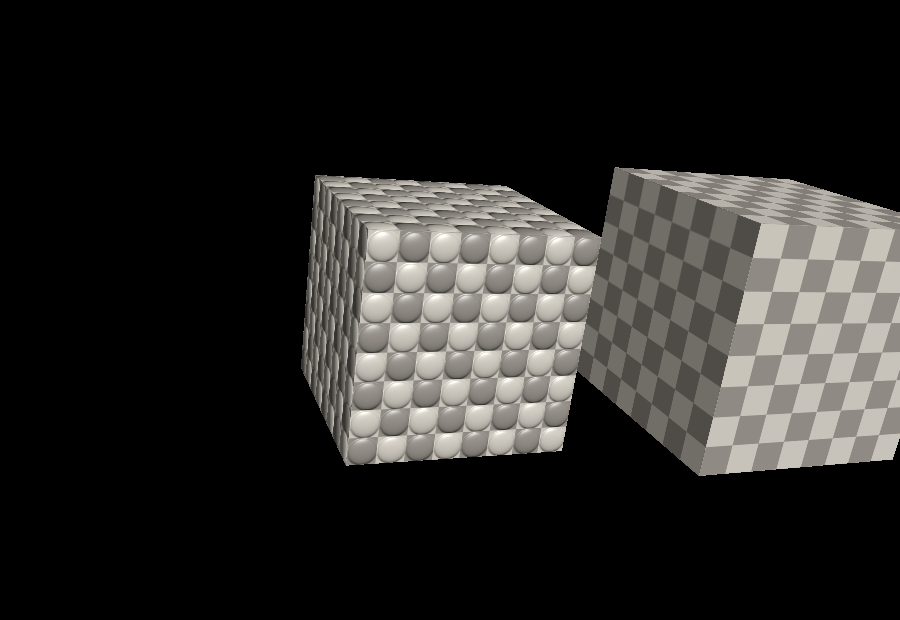

# SoftEngine

A **software 3D rasterizer** written in C#. The entire pipeline — model transforms, projection, culling, clipping, scanline rasterization, z-buffering and shading — runs on the CPU with no GPU or graphics-API dependency. A WinForms front-end renders live into a bitmap so you can orbit models, switch shading modes, and watch per-frame render statistics.



|  |  |
| :--: | :--: |
| Elephant — 26k triangles across 5 meshes | Parrot — 7k triangles |

## What it does

- Loads and renders 3D models (Wavefront `.obj`, Collada `.dae`, **glTF 2.0** `.gltf`/`.glb`) and procedural primitives in real time.
- Rasterizes triangles with a generic scanline filler and a depth (z) buffer.
- Supports several shading modes — wireframe, solid, flat, Gouraud, Phong, textured, full material and **physically-based** — selectable at runtime.
- Lights a scene with **any number of coloured lights** — directional, point with distance falloff, and spot.
- Rasterizes into an **HDR linear float target**, so highlights brighter than white survive to the post-process stack.
- Surrounds the scene with an **environment cube map**, drawn as a skybox and reduced to the ambient light the painters use.
- Casts **shadows** with a shadow-map pass rendered from the light's point of view, split into **cascades** fitted to slices of the camera's own view distance, and **screen-space ambient occlusion** for the contact detail a shadow map cannot resolve.
- Shades **materials**: albedo, tangent-space normal and specular maps, loaded from a model's `.mtl`.
- Deforms **skinned meshes** over a **scene graph** of transforms, played from keyframed animation clips — all imported from Collada.
- Runs a **post-process stack** over the finished frame — bloom, tone mapping, FXAA, vignette.
- Anti-aliases by **supersampling**: render at a multiple of the display resolution and average down.
- Shades **metallic-roughness materials** with a Cook-Torrance microfacet model, lit by the scene's lights and by a split-sum approximation of its environment.
- Answers clicks by **ray-casting the world** rather than reading the frame, outlines what it hits, and lets it be **moved, turned and stretched by dragging** the transform handles.
- Presents the frame's own **intermediate buffers** — depth, normals, overdraw, the shadow map — in place of the shaded image.
- Provides an interactive arc-ball camera, WASD fly controls, gizmos (world axes, ground grid), and a live stats overlay.
- Ships a **graphics debugger** — event list, object table and per-pixel history — built on the renderer's own instrumentation.

|  |  |
| :--: | :--: |
| Shadow mapping — one depth pass from the light | Normal mapping — the same two cubes, 12 triangles each; only the left one has a normal map |

## Shading modes

| Mode | Painter | Description |
| --- | --- | --- |
| **None** | — | Geometry only (combine with the wireframe overlay to see edges). |
| **Classic** | `ClassicPainter` | Flat per-triangle base color, no lighting. |
| **Flat** | `FlatPainter` | One Lambert (N·L) light per triangle from its centroid normal. |
| **Gouraud** | `GouraudPainter` | Per-vertex Lambert light interpolated across the triangle. |
| **Phong** | `PhongPainter` | Per-pixel Blinn-Phong from an interpolated world position and normal. |
| **Textured** | `TexturedPainter` | Perspective-correct texturing with Gouraud lighting, bilinear filtering and mip-maps. |
| **Material** | `MaterialPainter` | Per-pixel albedo, normal and specular maps over Blinn-Phong — the full material path. |
| **Physically based** | `PbrPainter` | Cook-Torrance metallic-roughness, lit by the scene's lights and by its environment. |

A `WireFramePainter` overlay (Liang–Barsky homogeneous line clipping) can be drawn on top of any mode.

## Lighting

A scene's lights are a list, and every lit painter sums over all of them. Each carries a
colour as well as an intensity, so a warm key and a cool fill produce a surface whose lit
side and shadowed side differ in hue rather than only in brightness — and the sum is never
clamped, because two lights on one surface really do deliver twice the light.

| Light | Falls off | Notes |
| --- | --- | --- |
| [`DirectionalLight`](src/SoftEngine.Core/Scenes/Lights/DirectionalLight.cs) | Never | Parallel rays; the sun. |
| [`PointLight`](src/SoftEngine.Core/Scenes/Lights/PointLight.cs) | With distance, if given a `Range` | Windowed inverse-square, reaching exactly zero at the range rather than trailing off forever. `Range` is infinite by default, which is the no-falloff behaviour the engine had before. |
| [`SpotLight`](src/SoftEngine.Core/Scenes/Lights/SpotLight.cs) | With distance and angle | Two cone angles, so the beam's edge ramps instead of stepping — a single angle aliases in the lighting, where no amount of supersampling can reach it. |

The `ILight` interface is not what a shader talks to. Every light is flattened once per
frame into a [`ShaderLight`](src/SoftEngine.Core/Shading/ShaderLight.cs) — a struct of plain
floats — and the frame's set into a [`LightSet`](src/SoftEngine.Core/Shading/LightSet.cs),
so the per-pixel loop is a branch on a field rather than a virtual call that also forfeits
inlining. The array is reused across frames.

Only the first light casts a shadow: the shadow map is one depth buffer taken from one point
of view, so a second shadowed light would need a second pass and a second buffer.

## High dynamic range

An 8-bit render target cannot hold a value above white. A specular glint five times paper
white and one exactly at it are the same pixel by the time anything downstream sees them —
which means bloom deciding what is "bright" and tone mapping "compressing the range" are both
working on an image whose brights were flattened before they arrived.

`Scene.HighDynamicRange` rasterizes into a linear float buffer instead
([`FrameBuffer.SetHighDynamicRange`](src/SoftEngine.Core/Buffers/FrameBuffer.cs)). A shader
returns a [`LinearColor`](src/SoftEngine.Core/Shading/LinearColor.cs) — linear light with no
ceiling — and the value is clamped once, at the very end of the frame, after the effects have
had it. It pairs with `GammaCorrect`, which is the path where the shaders produce light rather
than pre-encoded bytes and so the only one with a range above white to keep.

Two things moved into linear light along with it, because that is where mixing light is
defined: **alpha blending** and **fog**. Half of a full-intensity channel encodes to about
188, not to 128 — the latter is a good deal darker than half the light.

## Environment and ambient

`Scene.Environment` is a [`CubeMap`](src/SoftEngine.Core/Geometry/CubeMap.cs), and it does two
jobs.

[`SkyRenderer`](src/SoftEngine.Core/Pipeline/SkyRenderer.cs) draws it behind the scene. There
is no cube to rasterize: a skybox drawn as geometry is really just a way of getting a
direction interpolated per pixel, and here the direction comes straight from the pixel's
position through the inverse projection — no seams where the cube's own triangles meet, and
nothing that can be clipped by the near plane. It runs *between* the opaque and transparent
passes, filling only pixels whose depth is still the cleared value: after the opaque fill so
it shades nothing that was covered, and before the transparent one because that blends
without writing depth, so a sky drawn last would paint over the glass rather than behind it.

The same map also becomes the ambient term, as an
[`AmbientCube`](src/SoftEngine.Core/Shading/AmbientCube.cs) — six directional averages instead
of one constant. A flat ambient says a ceiling and a floor in the same room receive the same
light from their surroundings, which is never true: one faces the sky and the other faces the
ground. Averaging each face and blending the three a normal points toward is the cheapest
correction that says otherwise. The per-pixel painters evaluate it with the *shading* normal,
so a normal map shapes the ambient the same way it shapes the lights.

[`SkyBox.Gradient`](src/SoftEngine.Core/Geometry/SkyBox.cs) generates one procedurally — zenith,
horizon, ground and a sun disc — so a scene can have a sky, and therefore directional ambient,
with no asset to load.

## Shadow mapping

Shadows come from a second, depth-only render of the world from where the light stands
([`Pipeline/Shadows/ShadowMapRenderer.cs`](src/SoftEngine.Core/Pipeline/Shadows/ShadowMapRenderer.cs)).
Shading a point then means projecting it with the same matrix and comparing: if something
nearer to the light already occupies that direction, the point is in shadow.

- The light gets an **orthographic** projection ([`OrthographicProjection`](src/SoftEngine.Core/Scenes/Projections/OrthographicProjection.cs)) sized to a sphere around what it covers, so the map works from any angle. Point lights are approximated as directional — accurate while the light sits outside the scene.
- The pass is the main pipeline with everything that doesn't affect occlusion removed: no colour, no lighting, no varyings. It uses a **bounding-box edge-function rasterizer**, split into contiguous bands of rows so it parallelizes without locking the depth buffer.
- **Phong and Material** sample the map per pixel; **Flat, Gouraud and Textured** fold the visibility into their per-vertex intensity. Ambient light is never shadowed, so a shadowed surface darkens rather than going black.
- **Bias is measured in shadow-map texels of depth**, not raw normalized depth — one texel of error means the same thing in a 2-unit skull and a 1500-unit elephant, so it does not need retuning per scene or per resolution. A slope term scales it with the light's incidence angle.
- Transparent and hidden meshes are excluded: something you can see through should not block the light, and a mesh dropped from the frame should not leave its shadow behind.

`Scene.Shadows` ([`ShadowSettings`](src/SoftEngine.Core/Scenes/ShadowSettings.cs)) controls resolution, bias, 3×3 PCF filtering, shadow strength, and the cascades below.

### Cascades

One map over a whole scene spends its resolution uniformly, which puts the texels where they
do least good. Perspective makes a shadow ten units from the eye cover a hundred times the
pixels of one five hundred units away, and a single map gives them the same number of texels:
the near shadow comes out as a staircase while the far one is finer than anything can see.

`ShadowSettings.CascadeCount` splits the pass into up to four depth buffers, each fitted to a
slice of the camera's own view distance. Four decisions make the difference between cascades
that help and cascades that flicker:

- **The slices are divided by a blend of two schemes.** Evenly by distance gives the near
  slice — where nearly all the pixels are — the same span as the far one. Evenly by *ratio*,
  each slice a fixed multiple of the last, puts the first boundary a few units in front of the
  eye. `SplitBlend` interpolates between them, weighted toward the ratio.
- **Each cascade is fitted to a sphere, not a box.** A box fitted to a slice's eight corners
  changes size as the camera turns, and every shadow edge in the frame breathes with it. A
  sphere around the same corners depends only on the slice's dimensions, which rotating does
  not change.
- **The fit is snapped to whole texels.** Otherwise the light-space grid slides continuously as
  the camera moves, each frame re-dicing every shadow edge into different texels — which reads
  as crawling, and is far more visible in motion than the aliasing it comes from.
- **A cascade only rasterizes the casters that can reach it.** Under a parallel projection
  that is a question about perpendicular distance to the light axis and nothing else. It is
  where the extra passes pay for themselves: the near cascade covers a few units and rejects
  nearly everything, so three cascades over a long scene cost well under three times one map.

Which cascade shades a point is decided by **containment**, not by its view depth: the cascades
are nested, so the first one that covers the point is also the sharpest one that does. That
keeps `ShadowMap.Visibility` a function of world position alone, which is what lets the same
call work from a vertex-lit painter and a per-pixel one without either knowing cascades exist.
Every cascade but the last hands a point over a filter's width early, so the seam between two
of them is not a bright line of taps that fell off the edge of a buffer.

Two honest limits. Cascades are slices of a view frustum, so the standalone shadow-map API
produces a single map when it is called without a camera rather than guessing at one — and a
**parallel projection** stays on the single-map path, because its shadow map already covers the
view uniformly, which is the very thing cascades exist to fix.

The **Shadow map** buffer view shows every cascade side by side, nearest on the left, each
tinted so the sequence is readable at a glance.

## Materials and normal mapping

Every mesh carries a [`Material`](src/SoftEngine.Core/Geometry/Material.cs): a diffuse
colour, an albedo map, a tangent-space normal map, a specular mask, and the two numbers
that shape its highlight. `Mesh.Texture` is the albedo map under its older name, so nothing
that predates materials had to change.

Normal mapping adds surface detail finer than a vertex without adding a single triangle. It
needs a per-vertex UV frame, which [`TangentBuilder`](src/SoftEngine.Core/Geometry/TangentBuilder.cs)
derives by solving each triangle's edges against its UV deltas and accumulating the result
per vertex — including the ±1 handedness that mirrored UV islands flip. Frames are built
in the painter's `Prepare`, before the parallel paint phase, exactly as mip chains are.

The OBJ importer reads `Kd`, `Ks`, `Ns`, `d`/`Tr`, `map_Kd`, `map_Ks` and the normal map
under all of its spellings (`map_Bump`, `bump`, `norm`).
[`NormalMapBuilder`](src/SoftEngine.Core/Geometry/NormalMapBuilder.cs) converts a height map
into a normal map, since `map_Bump` was specified as one and is used as the other.

## Physically-based shading


*One albedo and one lighting setup. Roughness runs left to right, metalness bottom to top —
and the top row reads as a different **material** rather than as the bottom row at another
brightness, which is the whole point of the model.*

[`PbrPainter`](src/SoftEngine.Core/Rasterization/Painters/PbrPainter.cs) and
[`PbrShader`](src/SoftEngine.Core/Rasterization/PbrShader.cs) shade a metallic-roughness
material with the Cook-Torrance microfacet model. What separates it from the Blinn-Phong path
is not the number of terms but what they are answerable to: specular strength and shininess
are two dials with no units, tuned under one light and wrong again when it moves, where
roughness and metalness describe the *surface* and hold under any lighting.

Three functions do the work, and everything else is one of them evaluated somewhere
([`Ggx`](src/SoftEngine.Core/Shading/Ggx.cs)):

| Term | What it says |
| --- | --- |
| **D** — Trowbridge-Reitz distribution | What fraction of the microfacets face a given direction. Its long tail is why a real highlight has a bright core fading into a wide haze rather than an edge. |
| **V** — height-correlated Smith visibility | How much the surface shadows and masks itself at grazing angles, carried with the specular denominator already folded in. Height-correlated because masking and shadowing happen on the same surface. |
| **F** — Schlick Fresnel | How reflectivity climbs toward 1 edge-on. A dielectric reflects the same 4% whatever colour it is; a metal has no diffuse at all and tints its reflection with the albedo. That one interpolation is the entire difference between the rows above. |

Roughness is squared into the model's α before use — the Disney mapping, which makes the
visible change per unit of roughness roughly even.

**The environment is half the lighting**, and it arrives through the split-sum approximation.
[`PrefilteredEnvironment`](src/SoftEngine.Core/Shading/PrefilteredEnvironment.cs) convolves the
cube map with the GGX lobe once per roughness, so a surface looks up what it reflects with a
single sample instead of integrating a hemisphere per pixel; level 0 is the source map itself,
because a mirror wants the sharpest image available rather than a blurred copy of it.
[`BrdfLut`](src/SoftEngine.Core/Shading/BrdfLut.cs) is the other half — the BRDF integrated
against a *white* environment, which depends on nothing but `n·v` and roughness because F0
factors out of it into a scale and a bias. Two numbers per texel, one 32×32 table, every
material in every scene.

**One deliberate deviation.** The physical BRDF divides diffuse by π, and every other painter
here multiplies albedo by `n·l` with no such divisor — so an identical scene would render
about three times darker the moment you clicked a different radio button. The whole BRDF is
therefore scaled by π, which is the same as saying the engine's lights carry irradiance with
the 1/π already folded in. It changes the exposure, never the ratio of diffuse to specular,
which is the part that has to be right.

Maps degrade one at a time, exactly as `MaterialPainter`'s do: metallic from a map's blue
channel and roughness from its green (the channels glTF packs them into), falling back to the
material's scalars, falling back to a mid-grey dielectric lit from the triangle colour. So the
mode can be switched on over any scene in the viewer, not only ones authored for it.

## glTF 2.0

[`GltfImporter`](src/SoftEngine.Core/Geometry/Gltf/GltfImporter.cs) reads both forms of the
format: the JSON one (`.gltf`, with buffers and images beside it or inline as data URIs) and
the binary container (`.glb`).

glTF is the format this engine already had the shading model for. Collada carries geometry,
skins and clips, but describes surfaces with the specular-and-shininess vocabulary of a decade
earlier — so the physically-based painter could only ever be pointed at procedural demos or
hand-set scalars. A glTF material is metallic-roughness, and its packed texture puts roughness
in green and metalness in blue, which is exactly what
[`Material.MetallicMap`](src/SoftEngine.Core/Geometry/Material.cs) and `RoughnessMap` already
read: those channels were chosen for this format before there was a reader for it. One packed
map is assigned to both properties rather than decoded twice.

| Read | Not read |
| --- | --- |
| The default scene's node hierarchy, with instancing | Morph targets (`weights` animation channels) |
| Every mesh primitive as its own mesh, one per material | Cameras and `KHR_lights_punctual` |
| Triangles, strips and fans; indexed or not | `KHR_texture_transform` |
| Metallic-roughness materials, base-colour / normal / metallic-roughness / emissive maps, `KHR_materials_emissive_strength` | A second UV set (`TEXCOORD_1`) |
| Skins with their inverse bind matrices | Draco and meshopt compression — **refused by name**, see below |
| Animation samplers in all three interpolation modes | |

Four details worth naming:

- **The matrix convention is the opposite of Collada's, and needs no work.** glTF stores a
  matrix column-major for the column-vector convention — element (row *r*, column *c*) at index
  *c*·4 + *r*. This engine composes row-vector matrices, which are the transpose, and
  transposing a column-major array *is* reading it row-major. So the sixteen floats go straight
  into `Matrix4x4`'s constructor untouched, where Collada's have to be transposed. The two
  files disagree, not the two engines.
- **Sparse accessors are decoded.** An accessor that stores only the elements differing from a
  base is rare outside morph targets, and ignoring it renders the base — which for positions is
  the wrong *shape*, not a missing detail. It fails silently, which is why it is implemented.
- **All three interpolation modes are honoured**, which is why
  [`TrackInterpolation`](src/SoftEngine.Core/Animation/TrackInterpolation.cs) exists. `STEP` is
  how a blinking light or a swapped-out prop is authored, and blending it produces a value the
  animator never wrote. `CUBICSPLINE` stores three values per key — the tangent in, the value,
  the tangent out — so reading it as a plain value array both misreads the values *and* triples
  the apparent key count; it is sampled as the cubic Hermite it is.
- **A file requiring compressed geometry is refused with the extension's name.** A Draco
  primitive's accessors describe a compressed stream, and reading them as vertices produces a
  mesh made of noise — which looks like a bug in the renderer rather than an unread file.

Decoding images stays out of the Core, as it does for OBJ: the importer resolves all three
places an image can live — a file beside the model, a data URI, a stretch of the GLB's binary
chunk — down to bytes, and the front-end supplies one decoder for them.

A glTF mesh instanced by several nodes becomes several engine meshes **sharing one vertex
array**. Nothing in the pipeline writes to a vertex, so a second instance of a dense model
costs one small object rather than the whole model again. The triangle colours are not shared,
because recolouring one instance and finding its twin recoloured is a trap the engine's own
primitives already lay once.

## Picking


[`ScenePicker`](src/SoftEngine.Core/Picking/ScenePicker.cs) answers *what did I just click on*
by intersecting the world with a ray, not by reading anything the frame drew.

The alternative — rendering an identifier per pixel and looking one up — is what a GPU
renderer usually does, and it answers a subtly different question: what was *drawn* there, at
the resolution it was drawn at, after culling and the depth test. A ray answers what is
*there*. It costs nothing per frame, works on geometry the frame never rasterized, reports the
exact triangle and the point on it rather than a pixel's worth of it, and — being pure
geometry with no framebuffer in it — can be tested without rendering anything at all.

- The ray is the pipeline run backwards, and its screen mapping matches
  [`FrameBuffer.ToScreen3`](src/SoftEngine.Core/Buffers/FrameBuffer.cs) exactly. It goes
  through the pixel's **centre**, which is where the rasterizer decided coverage; aiming at the
  corner would put the two answers half a pixel apart along every silhouette in the frame —
  exactly where a person is most likely to click.
- Whole meshes are rejected against their bounding spheres first, so a click on a scene of
  forty thousand cubes tests a handful of them. The sphere follows the whole scene-graph chain,
  not just the mesh's own scale.
- **Möller-Trumbore, both faces.** A click is a question about geometry, not about winding: a
  single-sided test would make an inward-facing wall unclickable for no reason the user can see.
- Hidden and fully-faded meshes are skipped; transparent ones are not. Something you can see
  through is still something you can point at.

`Settings.HighlightedMesh` outlines the hit in amber, and it walks the frame's own draw lists
rather than the mesh — so a mesh culled out of the frame highlights nothing, which is the
honest answer.

### Dragging what you picked

[`TransformGizmo`](src/SoftEngine.Core/Gizmos/TransformGizmo.cs) puts handles on the picked
mesh: three arrows to move it, three rings to turn it, three arms with a box on the end to
stretch it.

It is built out of the two things picking already provides. A handle is just more geometry to
test the click's ray against — an axis is a line segment, a ring is a circle in a plane. And
once a handle is grabbed, the same ray answers the question the drag is actually asking: how
far *along* this axis, or how far *around* it, is the cursor now? So the gizmo reads nothing
from the frame, works on geometry the frame never rasterized, and can be driven — and tested —
with no rendering at all.

- **The handles are sized in screen terms**, a fixed fraction of the viewport's height
  converted back to world units at the gizmo's own distance. A gizmo measured in world units is
  unusable at both ends of the range this renderer covers: a speck on a 1500-unit elephant, and
  swallowing a 2-unit skull.
- **The grab frame is frozen when the drag starts.** The gizmo is drawn at the mesh's own
  origin, so translating the mesh moves it — and measuring each step against the moved frame
  feeds the mesh's motion back into the number that caused it, running it away from the cursor.
  The line being dragged along stands still; only the drawing follows.
- **Every step is measured from where the drag began**, not from the step before it, so a
  cursor that wanders off the handle and comes back leaves the mesh where the pointer is rather
  than where the accumulated error put it.
- **The handles are drawn without a depth test**, alone among the gizmos. A grid or a skeleton
  is describing where things are, so hiding behind them is right; a manipulator is not — you
  grab it with a ray that knows nothing about depth, so a handle buried inside the mesh it is
  attached to would be a control you can use and cannot see.
- **A parented mesh's drag is carried back through its parent.** `Position` on a mesh hanging
  off a node is an offset in that node's space, so a world-space drag on a mesh under a node
  scaled ×8 would otherwise run eight times as far as the cursor.

One deliberate limitation, and it is the format's rather than the gizmo's: **rotation drives
the mesh's own Euler angles**, because that is what `IMesh` stores — the Y ring is yaw, the X
ring pitch, the Z ring roll. With two of the three at zero that is exactly a rotation about the
world axis drawn; with all three set it is not, because composed Euler angles cannot express
one. Turning `Mesh.Rotation` into the quaternion `SceneNode` already uses is what would fix it,
and this is one more reason to.

## Scene graph

A mesh with nothing but its own position can only ever be placed absolutely. There is no way
to say *the hand goes wherever the arm puts it* — and that sentence is most of what a model
that moves consists of.

[`SceneNode`](src/SoftEngine.Core/Scenes/Graph/SceneNode.cs) is one transform in a hierarchy:
a local translation, rotation and scale, a parent, and the world matrix that composing the
chain produces. `IMesh.Parent` hangs a mesh off one, and the mesh's own transform becomes an
offset from the node rather than from the origin. Nothing that predates the graph changed —
a mesh with no parent composes exactly the matrix it always did.

Two decisions worth naming:

- **World matrices are cached, not walked on every read.** A skinned mesh reads its joints'
  world matrices once per vertex influence; re-composing the chain at each read would make a
  deep skeleton quadratic in its own depth.
- **A node's rotation is a quaternion**, where `Mesh` still carries Euler angles. Animation
  has to interpolate between two rotations, and Euler angles interpolate through gimbal lock.

Nodes also carry a [`SceneNodeKind`](src/SoftEngine.Core/Scenes/Graph/SceneNodeKind.cs). A
scene file's node tree is not all rig: exported alongside the bones are the nodes holding the
artist's lights and cameras, which sit metres away and dwarf the model. Only the skeleton view
reads the kind, and it is what makes that view legible on a real file.

## Skeletal animation


*A tube rigged to seven joints, mid-bend. The wireframe is the point: the rings crowd on the
inside of each curve and spread on the outside, which is a mesh being deformed rather than a
rigid one being rotated.*

### Skinning

[`SkinnedMesh`](src/SoftEngine.Core/Geometry/Skinning/SkinnedMesh.cs) implements linear blend
skinning. Each vertex is transformed by every joint that claims it and the results mixed by
weight — equivalently, and this is how it is computed, the joint matrices are mixed first and
the vertex transformed once.

The deformed positions are written back into the arrays [`Mesh`](src/SoftEngine.Core/Geometry/Mesh.cs)
already exposes, so **the renderer needs no knowledge of skinning at all**: it transforms
`Mesh.Vertices` exactly as it always has, and they simply happen to have moved since the last
frame. The bind pose is kept privately, because deforming the deformed output would compound
the pose frame after frame.

- A [`Skeleton`](src/SoftEngine.Core/Geometry/Skinning/Skeleton.cs) holds the joint nodes and
  their **inverse bind matrices**. A joint's inverse bind undoes the transform it had when the
  mesh was modelled; its current world matrix puts the vertex back down wherever the joint has
  moved to. The product is the only thing skinning needs per joint, so it is built once per
  pose rather than once per vertex.
- [`SkinWeights`](src/SoftEngine.Core/Geometry/Skinning/SkinWeights.cs) stores a fixed four
  influences per vertex, flat rather than as an array of small arrays. Four is a budget, not a
  format limit — riggers paint six or eight, and the fifth is worth a fraction of a percent —
  so the builder keeps the four heaviest and renormalizes.
- **Normals are deformed too**, by the same blended matrix and then renormalized. Strictly a
  normal wants the inverse transpose, which differs once a joint scales non-uniformly; joints
  rotate and translate, and renormalizing covers the rest. Tangents follow the same path when
  a skinned mesh has them, so normal mapping survives a pose.
- **The bounding sphere is remeasured with every pose.** The renderer culls whole meshes
  against it, and a raised arm reaches outside the sphere the bind pose fitted in.

One deliberate leniency: a skin covering fewer vertices than its mesh leaves the rest at bind
pose instead of throwing. Malformed weight tables are common in exported files, and a model
that renders with a stiff patch beats one that will not load.

### Clips and playback

An [`AnimationClip`](src/SoftEngine.Core/Animation/AnimationClip.cs) is a set of per-node
curves — translation and scale as `Vector3Track`s, rotation as a `QuaternionTrack` that slerps
along the shorter of the two arcs between neighbours. Clips are pure data and hold no playhead,
so two things can play one clip at different times; [`AnimationPlayer`](src/SoftEngine.Core/Animation/AnimationPlayer.cs)
owns the time, the speed and the looping.

Channels address nodes **by name**, which keeps a clip independent of any one skeleton. Names
are resolved once, at construction, into an array parallel to the channel list — the parrot
would otherwise spend thousands of string comparisons per frame to move a wing.

Outside a clip's own span, values are *held* rather than extrapolated. A clip says nothing
about what happens before its first key, and guessing produces motion no animator authored.

Files bake a joint's whole transform into one `float4x4` curve far more often than they key
the components separately, so a matrix track is decomposed into translation, rotation and
scale **once, at load**. Blending the matrices themselves component by component shears a
rotating joint, because the halfway point between two rotation matrices is not a rotation
matrix.

`IWorld.Update(deltaSeconds)` runs the whole chain: play the clips, refresh the hierarchy,
re-deform anything skinned. The renderer never calls it — rendering a frame twice, which the
graphics debugger does every time a probed pixel is re-recorded, must not advance time.

### What the importer reads

`MeshFactory.ImportColladaScene` returns an [`ImportedScene`](src/SoftEngine.Core/Geometry/ImportedScene.cs):
the meshes, the visual scene's node tree, the skin controllers bound to it, and the animation
channels that pose it. It is the same type the glTF reader returns, because a scene is a scene —
the two readers disagree about matrix conventions, chunk layout and where a material's roughness
lives, and about nothing downstream of that. `HackyImportCollada` is untouched and still returns
bare meshes, which is all a static model needs.

Collada writes matrices for the **column-vector** convention — a point is transformed as
`M·v`, and a node's translation sits in the fourth column. This engine composes row-vector
matrices, `v·M`, with translation in the fourth row. The two are transposes of each other, so
every matrix is transposed on the way in and nothing downstream knows the file's convention.
The bind shape matrix is folded into the bind pose at load, so it costs nothing per frame.

### Seeing the rig


A skeleton is invisible in a rendered image by construction: it is the thing that moves the
vertices, never a thing that gets drawn. Which makes a rig that is subtly wrong indistinguishable
from a mesh that is subtly wrong. `Settings.ShowSkeleton` draws the hierarchy as bones — a line
to each node's parent, and a three-axis tick at each joint so a node with no children is still
visible.

Three bundled demos cover the two halves of the problem and the case where both are present:

| Demo | What it shows |
| --- | --- |
| **Bone chain (skinned)** | Geometry, rig and clip all generated — the smallest thing that exercises the whole skinning path, with a correct answer that is obvious by eye. |
| **Juliet (skinned)** | A real 55,000-vertex skin from a real file: 205 joints and weights painted by whoever rigged her. The file carries no animation, so the sway is authored against the joint names her rig actually uses — with every key composed *on top of* the joint's rest orientation, since a clip written against someone else's rig must not discard the pose it was modelled in. |
| **Parrot rig (animated)** | A twelve-second clip over a sixty-node hierarchy, and no skin binding the mesh to any of it — so a cube on each joint makes the hierarchy the model. Move a wing joint and the four cubes below it go with it. |

## Post-processing


[`PostProcessStack`](src/SoftEngine.Core/Pipeline/PostProcess/PostProcessStack.cs) runs
full-screen effects over the finished render target. It owns the conversion at both ends, so
effects only ever see linear float RGB — the space blurring and adding light are actually
defined in. Against an HDR surface the image arrives already linear and unbounded and no
decode happens at all; against an 8-bit one the stack decodes sRGB on the way in, and nothing
downstream can recover highlights the rasterizer already clipped.

| Effect | What it does |
| --- | --- |
| **SSAO** | Reconstructs a position and a normal per pixel from the depth buffer, samples a hemisphere around each, and darkens by the fraction of samples something else is in front of. |
| **Bloom** | Bright-passes and blurs at a quarter resolution, then adds the result back — a wide blur is what sells the effect, and it costs a sixteenth of the samples downsampled. |
| **Tone map** | Exposure plus a Reinhard or ACES filmic curve, so values above white roll off instead of flattening into one clipped patch. |
| **FXAA** | Detects luminance edges, works out which way each runs, and blurs across it — never along it. Fixed screen-sized cost rather than a multiple of the whole render. |
| **Vignette** | Darkens the frame toward its corners, normalized so it behaves the same at any aspect ratio. |

### Ambient occlusion

[`SsaoEffect`](src/SoftEngine.Core/Pipeline/PostProcess/SsaoEffect.cs) finds the creases and
contact points a shadow map at any sane resolution cannot resolve, from nothing but the depth
buffer the frame already has. The depth buffer is a partial model of the scene: one point in
space per pixel, and — by differencing its neighbours — the surface's orientation there. A
point is occluded to the extent that other points sit above its own tangent plane nearby.

Effects that want this declare `NeedsDepth`, and the stack then reads the z-buffer back as
*view-space distance* ([`FrameBuffer.ReadViewDepth`](src/SoftEngine.Core/Buffers/FrameBuffer.cs))
rather than as the quantized device depth the depth test uses — a screen-space effect's radius
is measured in world units, so it needs the distance, not something merely monotonic in it.
The read costs a full-screen pass, so it only happens when something enabled asked for it, and
it is only possible under a perspective projection.

Two honest limitations. It only knows what is on screen, so geometry outside the frame or
hidden behind something nearer occludes nothing — inherent to the technique. And it multiplies
the finished image, which darkens direct light along with ambient; separating the two in a
forward renderer means carrying the ambient in a buffer of its own through the whole frame.
`Radius` is a world-space distance and is the one number that must be scaled to the scene.

## Rendering pipeline

```
model ──worldMatrix──▶ world ──viewMatrix──▶ view ──projectionMatrix──▶ clip ──/w──▶ NDC ──▶ screen
```

Per frame, the `Renderer` ([`Pipeline/Renderer.cs`](src/SoftEngine.Core/Pipeline/Renderer.cs)):

1. Clears the color and z-buffers.
2. Renders the shadow map from the light, if the scene casts shadows — before any painter prepares, since every shade that follows reads it.
3. Transforms each mesh's vertices into view space (pooled `VertexBuffer` per mesh).
4. Rejects triangles behind the far plane, back-facing triangles (optional culling), and triangles outside the view frustum.
5. Projects survivors into clip space, maps to screen space, and bins them into the screen tiles they cover.
6. Fills the tiles in parallel through the active painter.
7. Draws the sky into whatever pixels the opaque pass left untouched.
8. Blends the transparent triangles over the result, farthest first.
9. Draws optional gizmos (XZ grid, world axes, skeleton) and outlines the picked mesh.
10. Runs the post-process stack over the finished image, and encodes it for presentation.
11. Swaps the image for one of the buffers that produced it, if a buffer view is selected.

The rasterizer ([`Rasterization/ScanlineRasterizer.cs`](src/SoftEngine.Core/Rasterization/ScanlineRasterizer.cs)) sorts a triangle's vertices by Y, splits it at the middle vertex, and walks two half-triangles, interpolating depth plus an arbitrary *varying* payload. Painters only supply a **varying** type and a **shader** — both are `struct` generics, so the JIT devirtualizes and inlines the per-pixel shade call with no allocation on the hot path.

## Tiled rasterization

The fill phase is split by **screen tile**, not by triangle: [`TileBinner`](src/SoftEngine.Core/Rasterization/TileBinner.cs)
sorts each frame's triangles into the 32×32-pixel tiles their bounding boxes touch, and one
worker owns each tile ([`ScreenTile`](src/SoftEngine.Core/Rasterization/ScreenTile.cs)). Because
tiles never overlap, the z-buffer needs no locking — and because a triangle only reaches the
tiles it covers, its per-triangle setup is paid once per tile instead of once per core.

Three things fall out of owning a rectangle of pixels:

- **Coarse depth rejection.** Before drawing a triangle into a tile, its nearest depth is
  compared against the farthest depth currently stored anywhere in that tile. If it is behind,
  the triangle is dropped whole — no rows walked, no pixels tested. The bound is re-read every
  few triangles, and a scan that buys no rejection doubles the interval to the next one, so a
  scene with no depth complexity stops paying for it. `Settings.HierarchicalZ` turns it off.
- **Vectorized depth tests.** Runs of `Vector<int>.Count` pixels are depth-tested at once, and
  a run entirely behind the z-buffer is skipped without interpolating or shading any of it.
  Depth is evaluated as an affine function of x rather than a running sum, so the vector test
  and the scalar loop agree exactly.
- **Contiguous memory.** A tile walks the framebuffer the way it is laid out, rather than
  every n-th row.

Measured at 1280×720 on eight hardware threads, the three together render a dense model about
**1.5–1.8×** faster than the row-interleaved fill they replace, and a scene with heavy overdraw
about **2×** faster.

## Supersampling

[`SuperSampler`](src/SoftEngine.Core/Pipeline/SuperSampler.cs) resolves a render target drawn
at an integer multiple of the display resolution back down to it. It is the one kind of
anti-aliasing that asks nothing of the rasterizer — the whole pipeline just runs larger — so
unlike FXAA it smooths specular glints and texture shimmer as well as silhouettes. Colours are
averaged in linear light, and alpha along with them, which leaves the edge pixels of a shape
over the cleared background correctly premultiplied for presentation. A 2× frame fills four
times the pixels, which is exactly what it costs.

## Interactive app

The WinForms app ([`SoftEngine.WinForms`](src/SoftEngine.WinForms)) renders the scene into a 32-bpp bitmap that is blitted to a `Panel3D`.

| Control | Action |
| --- | --- |
| **Left-drag** | Orbit the arc-ball camera |
| **Right-drag** | Pan; **left+right-drag** dollies |
| **Mouse wheel** | Move the camera in/out — the status bar's zoom percentage follows it (100% is the framing a world loads with) |
| **W / A / S / D** | Fly the camera forward / left / back / right (**Q**/**E** for down/up). Hold **Shift** to move faster, **Ctrl** for fine steps; the step scales with the camera's distance, so it works on a 2-unit skull and a 1500-unit elephant alike |
| **Left-click the viewport** | Probe that pixel *and* pick what is under it — the write history appears in the Pixel History panel, the hit mesh is outlined in amber and selected in the object table, and the status bar names it (**Esc** clears both) |
| **Drag a gizmo handle** | Move, turn or stretch the picked mesh, once a mode is chosen. The handle under the cursor highlights, grabbing one suspends the camera for the drag, and the status bar reports the mesh's new position, rotation or scale |
| **F12** | Save the current view as a PNG |
| **Load model…** | Pick a bundled world (skull, parrot, elephant, teapot, cubes, spheres, towns, shadows, cascaded shadows, normal mapping, PBR spheres, the three animated ones…) or open an OBJ, Collada or glTF file from disk |
| **Shading radios** | Switch between None / Classic / Flat / Gouraud / Phong / Textured / Material / Physically based |
| **Buffer view** | Present the shaded image, or the depth, normals, overdraw or shadow-map buffer that produced it |
| **Shadow cascades** | One map over the world, or two to four fitted to slices of the view distance |
| **Transform gizmo** | Off / Move / Rotate / Scale — the handles drawn on the picked mesh |
| **Display checkboxes** | Toggle wireframe triangles, back-face culling, XZ grid, world axes, skeleton, animation, fog, shadows, sky, gamma-correct light, HDR target, texture filtering, 2× supersampling |
| **Post-processing checkboxes** | Toggle ambient occlusion, bloom, tone mapping, FXAA and vignette independently |

A stats overlay reports triangle counts (total / back-facing / out-of-view / behind), pixel counts (drawn / z-rejected), and calculation vs. paint timing per frame.

## Graphics debugger

The front-end doubles as a small graphics debugger, modelled on [Rasterizr Studio](https://github.com/tgjones/rasterizr). Because the whole pipeline runs on the CPU, the panels show what the renderer actually did rather than what a driver reported.

| Panel | Shows |
| --- | --- |
| **Graphics Event List** | Every step of the frame in pipeline order — viewport and depth-range setup, buffer clears, the shadow-map pass, the view and projection matrices, then per mesh: vertex transform, cull results and the draw call, then the post-process pass and the present. |
| **Graphics Object Table** | Every object the frame touched — render target, depth buffer, camera, projection, painter, shadow map, post-process stack, lights, meshes and textures — with its size, vertex/triangle counts and dimensions. Meshes carry an **active** checkbox that drops them from the frame. |
| **Pixel History** | For the selected pixel: the clear, then each triangle that tried to write it — including the ones the depth test rejected — with the input-assembler and transformed vertex data, the depth comparison, and the previous → resulting colour, ending with the post-process pass's before → after. |

Identifiers are shared: `obj:7` in the event list is `obj:7` in the object table, and clicking an entry in the pixel history selects both. Clicking the viewport asks the same pixel two questions at once: the probe records what the renderer *did* there, and the ray says which mesh is *under* it — and the second selects the matching row in the object table.

### Buffer views

[`BufferVisualizer`](src/SoftEngine.Core/Pipeline/Debugging/BufferVisualizer.cs) presents one
of the frame's intermediate buffers in place of the shaded image. Everything it draws already
exists by the time the frame ends; the work is choosing a mapping to colour a person can read,
which is most of what makes a buffer view useful rather than merely available. The pass runs
last, over the finished image, so nothing upstream has to know it exists — and the buffer
being shown is the one the frame really used.

|  |  |
| :--: | :--: |
| **Shaded** — the frame the other four came from | **Depth** — auto-ranged over the geometry actually on screen, because a perspective depth buffer presented literally is a white screen |
|  |  |
| **Normals** — differenced out of the depth buffer, since a forward renderer has no normal buffer to show | **Overdraw** — writes per pixel, blue through red. Shown here with back-face culling off, which is the frame paying for the far side of every surface |
|  | |
| **Shadow map** — the depth the light recorded, fitted into the viewport with its aspect preserved | |

Two details that are the difference between a view you can trust and one you cannot:

- **Depth is fitted to the frame, not to the frustum.** The same view stays legible on a
  2-unit skull and a 1500-unit elephant.
- **Overdraw counts writes the rasterizer attempted**, not triangles that geometrically cover
  the pixel. A triangle the tile's coarse depth bound dropped whole never reaches a pixel and
  never shows up. That is the intended reading — the view answers "what did this frame pay
  for", which is the question overdraw is asked for.

A view the frame carries nothing for — normals under a parallel projection, the shadow map of
a scene that casts none — leaves the image alone, and says so in the event list rather than
logging a pass that never ran.

Recording is driven from `RenderDiagnostics` on the renderer ([`Diagnostics/`](src/SoftEngine.Core/Diagnostics)):

- Events are stored as a `readonly record struct` with a numeric payload in a reused buffer, and formatted only for the rows the list actually draws — a busy scene emits thousands of events per frame and capturing them allocates nothing.
- The pixel probe is a single int compare inside `FrameBuffer.PutPixel`, off (`-1`) unless a pixel is selected. The "what is drawing" context is thread-static: each paint worker owns a disjoint set of screen rows, so the one worker that owns the probed pixel is also the one that tags its writes, and they stay in draw order.
- Triangle vertices are snapshotted only when a write actually lands on the probed pixel, never per triangle.

Both can be switched off from the **View** menu, along with each panel.

## Project layout

```
src/
├── SoftEngine.Core/        # engine, no UI dependency (net10.0 class library)
│   ├── Animation/          # keyframe tracks, interpolation modes, node channels, clips, playback
│   ├── Buffers/            # FrameBuffer (color + z-buffer + pixel probe), pooled Vertex/World buffers
│   ├── Diagnostics/        # render stats, graphics event log, pixel history
│   ├── Geometry/           # IMesh/Mesh, Material, Triangle, tangents, primitives, OBJ/Collada importers
│   │   ├── Gltf/           # glTF 2.0 / GLB reader: schema, accessor decoding, scene building
│   │   └── Skinning/       # skeleton, skin weights, linear blend skinning, generated bone chain
│   ├── Gizmos/             # grid, world axes, skeleton, and the draggable transform handles
│   ├── Picking/            # ray, ray-triangle intersection, scene picker
│   ├── Pipeline/           # Renderer, settings, homogeneous clipping, sky pass
│   │   ├── Debugging/      # buffer views: depth, normals, overdraw, shadow cascades
│   │   ├── PostProcess/    # effect stack: SSAO, bloom, tone map, FXAA, vignette
│   │   └── Shadows/        # depth-only shadow-map pass, cascade fitting
│   ├── Rasterization/      # scanline filler, painters, shaders, varyings, texture sampling
│   ├── Scenes/             # world, camera, projections, lights, fog and shadow settings
│   │   └── Graph/          # SceneNode transform hierarchy
│   └── Shading/            # linear colour, light sets, ambient cube, sRGB conversion, shadow map,
│                           #   GGX, BRDF table, prefiltered environment
└── SoftEngine.WinForms/    # interactive front-end (net10.0-windows)
    ├── Debugging/          # event list, object table and pixel history panels
    └── Dialogs/            # model picker

bench/SoftEngine.Benchmarks/   # headless frame-time harness (net10.0 console)
tests/SoftEngine.Core.Tests/   # xUnit suite over the Core
```

## Requirements

- [.NET 10 SDK](https://dotnet.microsoft.com/download)
- Windows (the interactive app uses WinForms; `SoftEngine.Core` itself is platform-neutral).

## Build & run

```bash
# build everything
dotnet build SoftEngine.slnx

# run the interactive app
dotnet run --project src/SoftEngine.WinForms

# run the tests
dotnet test tests/SoftEngine.Core.Tests

# measure the renderer (Release, or the numbers measure the debugger)
dotnet run -c Release --project bench/SoftEngine.Benchmarks
```

## Performance notes

The renderer avoids managed-heap traffic on the pixel hot path:

- **`ColorRGB` is a `readonly struct`** — shaders can produce a color per pixel without allocating.
- **Struct-based varyings and shaders** let the JIT inline the shade call instead of dispatching through an interface.
- **`ArrayPool`-backed vertex buffers** are rented per frame rather than allocated.
- **Tile bins are flat arrays filled by a counting sort**, reused across frames, so binning tens of thousands of triangles allocates nothing either.
- **The frame's lights are flattened into structs once**, so the per-pixel loop over them branches on a field instead of dispatching through `ILight`.

One cost was accepted rather than avoided: shaders now return `LinearColor`, so a shader with
no HDR range to give converts a `ColorRGB` in and the framebuffer converts it back out —
six lookup-table reads per pixel that the old packed-byte path did not pay. Both tables are
small enough to stay in L1, and the alternative was two parallel shading paths.

### Measuring it

Work is measured rather than assumed. [`bench/SoftEngine.Benchmarks`](bench/SoftEngine.Benchmarks)
is a headless harness that renders fixed scenes and reports the median frame time:

```bash
dotnet run -c Release --project bench/SoftEngine.Benchmarks
dotnet run -c Release --project bench/SoftEngine.Benchmarks -- --scene overdraw --compare
```

The engine renders into a plain `int[]`, so measuring it needs no window, no GPU and no
platform beyond the runtime — which is what makes the numbers reproducible on any machine that
can build the solution. Six scenes cover the shapes the renderer is built around: a dense
model where the cost is per-triangle setup, heavy overdraw where it is the depth test, a
handful of screen-filling triangles, thousands of small meshes, the shadow pass, and the
physically-based shader.

The **median** rather than the mean, because a frame time distribution on a desktop OS has a
long right tail belonging to the scheduler rather than to the renderer — one preempted frame
moves a mean and cannot move a median. Warm-up frames are discarded for the same reason in the
other direction: the first frame through a scene pays for JIT and for every buffer, tile bin,
mip chain and prefiltered environment being allocated.

`--compare` re-runs each scene with hierarchical-Z off and reports the ratio. On eight hardware
threads at 1280×720 it is worth **≈4×** on the overdraw scene and about 1× everywhere else,
which is what it should be: the tile's coarse depth bound cannot reject anything in a scene one
layer deep, and it costs a periodic scan to find that out.

## Roadmap

- Replace `Mesh`'s `Rotation3D` (Euler angles) with the quaternion rotation `SceneNode` already uses — which is also what would let the transform gizmo's rings turn a mesh about a world axis rather than about its own.
- Animation blending — crossfading two clips, and layering one over another — which the player is one weight away from.
- Frame capture history, so the debugger can step back through earlier frames.
- A mip-level buffer view, the one view of the frame the visualizer still has nothing to draw from.
- More than one shadow-casting light, which needs a depth buffer and a pass per light.
- Morph targets, the one part of glTF's animation the importer reads past.
- A deferred or visibility-buffer path, which would let SSAO darken the ambient term alone instead of the finished image — the limitation the post-processing section admits to.

## Credits

Inspired by David Rousset's tutorial series
[*Learning how to write a 3D soft engine from scratch in C#, TypeScript or JavaScript*](https://www.davrous.com/2013/06/13/tutorial-series-learning-how-to-write-a-3d-soft-engine-from-scratch-in-c-typescript-or-javascript/),
which this project started from before growing its own pipeline, rasterizer, and shading system.

## License

[MIT](LICENSE) © Hilthon
